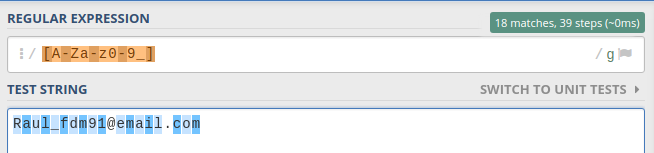
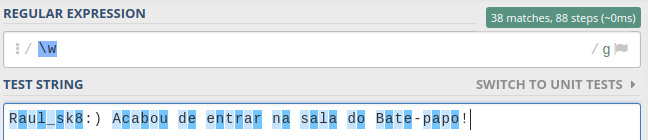
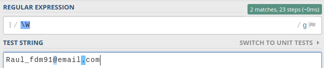

Continuando a saga mágica das Expressões Regulares, hoje vamos entender um pouco mais do que se treta meta-caracteres no mundo da Regex! Mas antes, se você ainda não viu a parte um, clica nesse link e da uma conferida!

Então, pega teu café/chá/chimarrão, respira e vem comigo!

---

## Metacharacter

Metacharacter ou Meta-caractere é todo caractere que **não** possui o seu valor semântico propriamente dito, ou seja, visualmente ele parece uma coisa, mas no fim ele tem um significado especial! — Hãm?

Quando você vê o caractere ponto (`.`) em um texto, qual é o significado dele? Bom, num texto normal provavelmente ele tem o valor de ponto final, não é? Na mosca, jovem! Entretanto, esse é o valor semântico associado ao português. No mundo das expressões regulares a história é um pouco diferente. Vamos dar uma olhada na prática para elucidar melhor.

O texto abaixo possui 3 pontos (.):

```txt
Seja bem-vindo(a). Esse é o encantado mundo da Regex. Meu nome é Raul e eu serei seu guia.
```

Sabendo que se quisermos selecionar um caractere específico em Regex, podemos passar ele diretamente na expressão. Logo, vamos tentar fazer isso com o **ponto**:


<Gif
  src="https://media.giphy.com/media/lkdH8FmImcGoylv3t3/giphy.gif"
  caption="90 MATCHES?????"
/>

Pois é. Em uma Expressão Regular, um **ponto** (.) tem o valor de qualquer caractere, ou seja, o que ele diz pra engine é: _“Pega mim **TUDO** que estiver no target”_.

> Mas Raul, eu quero selecionar o ponto, comofas?

Para tal, precisamos **“escapar”** o caractere utilizando a barra invertida (`\`). Com ela, falamos pra engine:

> _“Senhora Engine, por obséquio, pegue o valor literal deste caractere. O seu significado semântico.”_

Pedindo com tanto polidez, nossa solicitação será atendida:


<Gif
  src="https://miro.medium.com/max/1200/1*n1a96icH96hsBYqNi0iZEg.gif"
  caption="Empolgante!"
/>

Há mais alguns caracteres que possuem esse mesmo comportamento, a maior parte deles são quantifiers, e isso a gente vai ver futuramente.

---

## Outros tipos de meta

Além do _metacharacter_ citado, ainda temos um outro tipo. Esse é o inverso do anterior, ou seja, é quando o caractere tem seu valor literal interpretado normalmente pela Engine, mas quando colocamos uma barra invertida (`\`), concedemos super poderes à eles.

### Números

Lembra do exemplo do artigo 1, onde usamos `\d`? Então, ele é um exemplo muito fácil disso. Somente o `d`, é interpretado como a letra d. Mas usando a barra invertida, transformamos ele num _“pegador de caracteres alfanuméricos”_, veja no exemplo a seguir:


Desse tipo, temos uma série que será extremamente útil, vamos dar uma olhada com mais calma em cada um deles.

---

## Espaços em Branco

Lembro uma vez onde na empresa que eu trabalhava, a gente teve um problema com uma integração de um arquivo. Depois de muito quebrar cabeça, conseguiram descobrir que o software do cliente estava inserindo um caractere em branco que, segundo a tabela UNICODE, era um outro tipo de espaço em branco. E pelo fato de vir no meio do texto, um método trim() não resolvia.

No caso em questão, o pessoal não usou Regex, foram bem cangaceiros e conseguiram encontrar na raça! Mas, talvez tivesse sido um pouco mais fácil utilizando Regex, não?

Para esses casos, temos um metacharacter especial que é o `\s`! O que ele faz é considerar qualquer espaço em branco, seja ele um espaço, um tab, uma nova linha, um form feed, e até mesmo um vertical tab (nem sabia que existia tanto caractere para espaçamento).

Hands on!

```txt
nesse texto temos espaços,  tabs,
e new line
```

Poderíamos tentar pegar um por um, mas vamos ser espertos e pegar todos sem erro:


Então fica a regra: _“Precisa considerar espaços em branco na sua expressão? \s”_.

---

## Word Characters

**Word Characters**, ou caracteres de palavras (tradução livre), é o cara que vai nos ajudar a pegar todas as letras, números e underscore (underline).

Uma coisa que precisa ser mencionada e ser gravada no âmago da memória de vocês desde já é:

> _Expressões Regulares são case sensitive!_

Acredito que quem está lendo sobre expressões regulares já sabe o que é esse termo, mas caso você ainda tenha algum tipo de dúvida, case sensitive é quando caracteres maiúsculos e minúsculos não possuem o mesmo valor, ou seja, **A** é diferente de **a**, igual em senhas, sabe?

Quando queremos validar se um caractere é uma letra, podemos usar classes de caracteres (veremos no próximo artigo), passando a seguinte expressão:

```txt
[A-Za-z]
```

No exemplo acima, falamos que esperamos uma letra que esteja dentro do alfabeto e pode ser maiúscula ou minúscula. Mas vamos dizer que queremos pegar um nickname, e nele pode vir além de letras, números e underline (`_`)?

```txt
[A-Za-z0-9_]
```

Poxa, olha o tamanho disso.

E é aqui que entra o `\w`! A declaração acima, pode ser resumida apenas com `\w`. Duvida?





---

## Negando o meta-caractere

Legal esse monte de atalho pra gente usar, diz aí? Mas assim como eu me perguntei quando aprendi isso, você também pode ter se perguntado:

> Mas e se… eu quiser pegar qualquer caractere que **NÃO** for um número ou world character ou white space?

Para nossa alegria, existe uma forma bem simples de fazer essa negação. Nas linguagens de programação, geralmente quando a gente quer negar uma condição booleana (true/false), apenas passamos uma exclamação:

```txt
senhaRecebida == senha // A senha recebida é **igual** a senha?
senhaRecebida != senha // A senha recebida é **diferente** da senha?
```

Para fazermos isso, com esses 3 meta-caracteres que vimos, basta colocar a letra maiúscula! Sim, simples assim!



Isso também funciona com `\s`:


## Importante

Essa lógica vai ser aplicada pra outros meta-caracteres que veremos mais a frente. Logo, lembre-se dela! :D

---

## Conclusão

Esse artigo foi bem teórico apesar dos exemplos, mas é extremamente importante que você compreenda o que são os meta-caracteres e como eles são entendidos, pois, nos tópicos seguintes eles serão constantemente utilizados.

Espero que tenham gostado! Até o próximo! =D
