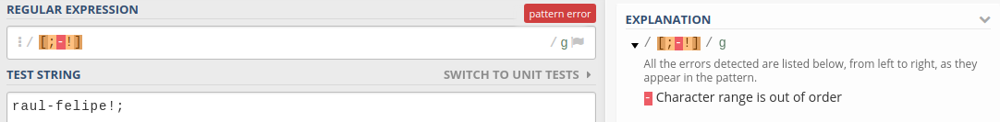
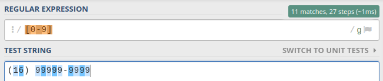
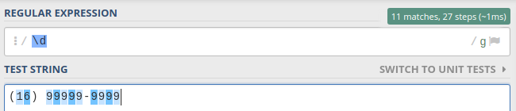
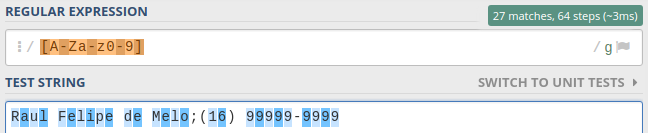
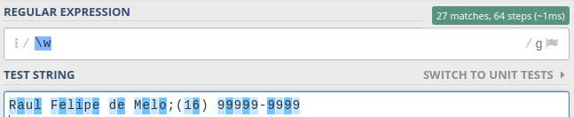
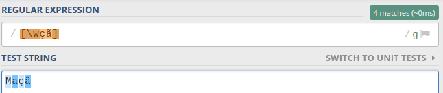

Fala galera, belezinha? Hoje o nosso bate-papo vai ser sobre uma das principais (e mais útil) funcionalidades das expressões regulares, **classes de caracteres**.

Sem delongas, liga teu _Pomodoro_, pega teu café/chá/chimarrão, me dê a mão (me abraça) e vem comigo!

---

## Classes de caracteres: O que são?

Classe de caracteres é uma maneira de dizer à Regex Engine que queremos pegar um conjunto específico de caracteres. Basicamente, é como se definíssemos que o que **pode** ou **não** aparecer naquele trecho (ou em toda) da expressão. Vamos a um exemplo pra facilitar o entendimento.

Suponhamos que queremos analisar (de uma forma pouco grosseira) se uma data é valida ou não. Sabemos que no formato PT_BR, ela segue o padrão **dia**/**mês**/**ano** (28/05/2017).

Esse padrão segue algumas regras básicas, por exemplo, o dia só pode começar com zero (0), um(1), dois(2) ou três(3). Então, como podemos fazemos então para dizer à Regex que o primeiro número precisa ser um desses 4 dígitos? Se você respondeu com classes de caracteres, parabéns! :D

---

## Expressando uma classe (ou conjunto)

Uma classe de caracteres é expressada de duas maneiras, são elas:

### Colchetes

O símbolo de colchetes (`[]`) são usados para indicar quais os caracteres queremos considerar. Voltando no exemplo anterior, para expressar que queremos apenas os números 0, 1, 2 e 3, podemos fazer:

```txt
[0123]
```

#### Hífen mágico

Outra forma de escrever a mesma coisa do exemplo acima, de forma bem bacanuda e mais sucinta, é utilizando o hífen (`-`).

Com ele, definimos um um range (alcance), ou seja, um valor inicial e um valor final, que no caso serve para letras e números. Melhorando a expressão anterior, temos:

```txt
[0-3]
```

Temos o mesmo resultado, de uma forma bem mais elegante.

#### Ponto de atenção!

Quando comecei a estudar sobre Regex, me deparei com uma observação sobre o uso hífen dentro de classes que me intrigou bastante.

Fora da classe o hífen é avaliado como hífen mesmo (valor semântico), mas como dito anteriormente, dentro ele é avaliado como um range. Assim, suponhamos que você queira considerar um hífen, ou ponto-e-virgula, ou exclamação em um trecho de texto. Para tal, podemos utilizar classe de carácter:



Pois é! Tomamos um erro logo de cara. Mas por que isso?

Bem, o que a engine faz é tentar encontrar o range entre o ponto-e-virgula (`;`) e a exclamação (`!`). E como isso não faz sentido, o erro acontece.

> Mas e aí? Como fugir disso?

Lembra do [post passado sobre meta-caracteres](/pt-br/2017/05/regex-part-2)? Sim, o hífen é um deles! E para resolver o caso, precisamos apenas passar a nossa amiga barra invertida (`\`):


### Shorthand

A segunda maneira de filtrar uma classe de caracteres é utilizando uma forma abreviada (shorthand) da própria linguagem.

#### Números

Em muitos casos, desejamos pegar números de zero (0) a nove (9). Logo, podemos fazer utilizando o hífen:



Mas podemos simplificar ainda mais utilizando o shorthand `\d` que tem exatamente o mesmo significado (números de 0 a 9):



#### Letras e números

No caso das letras, podemos definir na classe que queremos de `a` até `z` maiúsculo ou minúsculo e números de `0` a `9`, assim, usando **hífen** ficaria:



O _shorthand_ para esse mesmo valor seria o `\w`, mas com uma ressalva: ele considera underscore (`_`) também:



#### Qualquer carácter

Uma classe muito útil é o ponto (`.`). O ponto representa qualquer carácter, e quando eu digo qualquer, é realmente **qualquer** tipo (espaço, números, letras, etc.)

## HANDS ON!

<Gif
  src="https://miro.medium.com/max/300/1*6Kaa7nN-dwK4F70EYuBInA.gif"
  caption="Bora codar!"
  imgStyle="max-width: 300px;"
/>

> **Licença didática**: Antes de mais nada, gostaria de deixar claro que a validação que faremos a seguir é bem grosseira, ou seja, ela deixará brechas para uma data inválida, como 20/19/2999 (mês 19???). Assim, não validem se ela é uma data válida (de acordo com o calendário) dessa maneira. =)

Com todo esse conceito novo em mente, vamos atacar as datas então.

Eu não sei vocês, mas eu particularmente quando vejo uma expressão regular, fico meio confuso. Então, pra entender melhor, eu vou imaginando ela por blocos e no fim, junto todas as partes para entender o que ela faz em si.

Para resolver não é diferente! Vamos atacar a data por blocos.

### Dia

Para validar o dia, vamos seguir algumas regras:

- Pode vir unidade (9) ou dezena (09);
- Caso seja dezena, o primeiro número tem que ser entre 0 e 3;

  ```txt
  # Lembrando, o ? tem valor de:
  # pode ou não aparecer (veremos futuramente mais afundo)

  [0-3]?
  ```

- O segundo dígito pode ser de 0 a 9.

  ```txt
  [0-3]?\d
  ```

- Para finalizar, vem uma barra ao final dessa expressão. A barra é um meta-caractere, logo, precisamos escapar usando barra invertida:

  ```txt
  [0-3]?\d\/
  ```

Assim, temos o resultado:


## Mês

Para validar o mês, seguimos as diretrizes:

- O primeiro digito só pode ser zero (0) ou um (1) e pode ou não aparecer:

  ```txt
  [0-1]?
  ```

- O segundo digito pode ser qualquer número

  ```txt
  [0-1]?\d
  ```

- Terminando ele, segue uma barra:

  ```txt
  [0-1]?\d\/
  ```

Agora, juntando a expressão do dia e a expressão do mês, temos:


## Ano

O ano, seguirá as seguintes diretrizes:

- Queremos que o seja seja 1000 e 2000, logo, o primeiro digito será entre 1 e 2:

  ```txt
  // Note que não precisamos de range
  [12]
  ```

- Os outros 3 dígitos, pode ser de zero (0) a nove (9).

  ```txt
  [12]\d\d\d
  ```

Agora juntando a expressão do **dia**, **mês** e **ano**, teremos:


Apenas a titulo de curiosidade, podemos melhorar o **ano** utilizando um quantifier (veremos no próximo artigo), que diz quantas vezes aquela pequena expressão pode aparecer, ficando:

```txt
// A classe \d tem que aparecer aparecer 3 vezes
[12]\d{3}
```


---

## Extra: caracteres especiais

Antes de fechar o assunto, queria comentar um pouco a respeito sobre as letras e os caracteres especiais.

Lembra quando eu disse que a classe `\w` pega letras? Vamos tentar selecionar todas as letras da palavra **maçã**:


Pois é, tanto o `\w` quanto o `a-zA-Z` levam em consideração apenas o alfabeto, ou seja, `a` até `z`. Como a língua portuguesa é uma (p…) lindeza, e temos diversos símbolos como til (`~`), cedilha (`ç`), etc e sempre que quisermos validar textos que contenham esse tipo de informação, precisamos explicita-los dentro de uma classe:



Assim, pense nessa possibilidade quando estiver montando suas expressões! :)

---

## Conclusão

Classe de caracteres será sem dúvida, uma das coisas que você mais vai utilizar no uso das expressões regulares. Portanto, vale um ponto de atenção e dedicação para entender de verdade como elas funcionam!

Espero que tenham gostado! Caso tenham alguma dúvida ou sugestão, podem me mandar mensagem que eu terei o prazer de responder! \o
