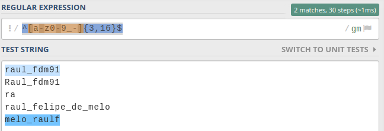
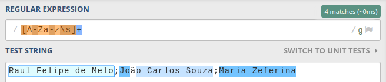
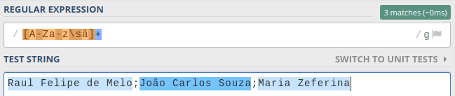
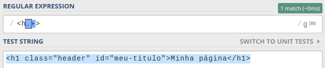

Fala galere, tudo em cima? Hoje é dia de mais um artigo sobre expressões regulares e hoje iremos abordar os quantifiers (quantificadores), ou seja, formas de definir quantas vezes queremos que elementos apareçam ou não em nossas expressões.

Então simbora que a gente ta na metade já =D

<Gif
  src="https://media.giphy.com/media/VmZWEOc2rigIU/giphy.gif"
  caption="Raul?… Raul…? …. Ahhh vamo nessa!"
  imgStyle="max-width: 600px;"
/>

---

## Quantifiers: O que são?

Como dito no começo do artigo, quantifier é uma forma de você dizer à Regex engine quantas vezes você quer que aquele carácter apareça. No primeiro exemplo do primeiro post eu citei um caso onde era necessário validar um **CEP**:

```txt
#Target

João da Silva;Rua Cabloco terceiro, 25;11111-111;(99)9999-9999
Márcio Cunha;Rua João Gourlat, 150;12123111;(99)8888-9999
```

Lembrando que as regras para a máscara do **CEP** são:

- 5 dígitos iniciais;
- Um hífen (que pode não vir);
- 3 dígitos finais.

Assim, resolvemos com a seguinte expressão:

```
\d\d\d\d\d-?\d\d\d
```

Resultando em:


Porém, dessa maneira é um pouco estranha né? Repetimos a mesma condição (`\d`) 5 vezes, depois mais 3 vezes. Mas, como deixar isso um pouco mais bonito? Sim, _quantifiers_.

---

## Declarações

Existem algumas maneiras de declarar um _quantifier_, cada um, atendendo a um propósito em **específico**. Nas maneiras a seguir, sempre que você ler “n” ou “m”, entenda como números inteiros quaisquer (matemática _feelings_?).

### Apareça “n” vezes

Quando queremos que um determinado caractere apareça **especificamente** “n” vezes, passamos o número de vezes (n) entre chaves, após alguma declaração. Lembra do caso do CEP? Como sabemos exatamente quantas vezes cada número **deve** aparecer, podemos mudar a nossa expressão de:

```txt
\d\d\d\d\d-?\d\d\d
```

Para

```txt
\d{5}-?\d{3}
```

E obtemos o mesmo resultado


---

### Apareça no mínimo “n” vezes

Há ainda os casos onde queremos que apareça um caracteres no mínimo “n” vezes. Para este caso, declaramos novamente as chaves, o número mínimo de vezes e em seguida, uma virgula, ficando:

```txt
{n,}
```

Agora para ver na prática, vamos imaginar que queremos avaliar um texto onde deverá vir no **mínimo** 4 letras seguido de no **mínimo** 8 dígitos:

```txt
#Target

regex1234567
reg12345678
regex12345678
regex123456789012
```

Como sempre digo, resolver a expressão por partes, teremos para a primeira parte (mínimo 4
letras [considerando maiúscula e minúscula]) a seguinte expressão:

```txt
[A-Za-z]{4,}
```

Para a segunda parte (no mínimo 8 dígitos), teremos:

```txt
\d{8,}
```

Juntando as duas partes e aplicando em nosso target, temos o resultado:


Perceba a primeira linha, não possuímos no mínimo 8 dígitos, logo, ela é desconsiderada. Na segunda linha, temos os 8 dígitos mas não temos no mínimo 4 caracteres! Já na terceira e quarta linha, temos a nossa condição totalmente atendida, uma vez que é **no mínimo**, ou seja, **“n” ou mais!**

---

### Apareça no mínimo “n” e no máximo “m”

Mas e nos casos onde queremos definir o mínimo e o máximo? Bom, para esses, ainda utilizaremos chaves, mas passaremos o número **mínimo “n”**, uma virgula, e o **número máximo “m”**:

```txt
{n,m}
```

Vamos imaginar que queremos validar um username com as seguintes regras:

1. Deve conter apenas letras minúsculas;
1. Pode conter números, underline e hífen;
1. Deve ter entre 3 e 16 caracteres.

Assim, teríamos a seguinte expressão:

```txt
^[a-z0-9_-]{3,16}$
```

> Obs.: Não se preocupe com o `^` e o `$` , são âncoras e veremos nos posts a seguir. Apenas tenha em mente que eles delimitam um começo e fim na expressão, ou seja, o texto deve corresponder exatamente aquela expressão.

Aplicando a expressão em alguns possíveis usuários, temos o resultado:



---

### Pode ou não aparecer (apenas uma vez)

Esse caso já vimos em alguns exemplos nos artigos anteriores. Para dizermos que o caractere pode ou não estar presente na nossa regex, utilizamos o interrogação:

```txt
?
```

Lembra da Regex do CEP? Podemos ou não receber um hífen da máscara. Para resolver isso, utilizamos o `?`:

```txt
\d{5}-?\d{3}
```

Vale ressaltar que esse caso tem o valor de zero (0) vezes ou uma (1) vez. Seria equivalente o `true` ou `false`.

### Pode não aparecer ou aparecer várias vezes

Diferente da interrogação, temos casos onde queremos dizer que tal caractere **pode ou não** aparecer, mas quando ele aparecer, pode ser **várias vezes**. Para tal, utilizaremos o símbolo de asterisco (ou estrela):

```txt
*
```

## Pelo menos 1 vez

Em casos onde queremos filtrar no mínimo uma vez, e não temos restrições máximas, podemos utilizar por chaves:

```txt
{1,}
```

Mas podemos ser mais sucintos ainda, utilizando o operador de mais:

```txt
+
```

Para ver isso melhor, vejamos o target abaixo:

```csv
Raul Felipe de Melo;João Carlos Souza;Maria Zeferina
```

Nele, iremos filtrar os 3 nomes completos. O que sabemos?

1. O nome tem apenas letras (maiúsculas e minúsculas);
1. Existe espaço entre o nome e sobrenome

Para pegar as letras e espaços, utilizaremos uma classe de caractere (caso não tenha visto ainda o post sobre, [clica aqui](/pt-br/2017/05/regex-part-3)) para considerar as letras e os espaços:

```txt
[A-Za-z\s]
```


Perceba que selecionamos as letras maiúsculas e minúsculas e os espaços em branco. Entretanto, foi selecionado cada letra e espaço individualmente. No fim, queremos que seja selecionado os blocos inteiros que corresponderão aos nomes, correto? Então é aqui que entra o _quantifier_ +:

```txt
[A-Za-z\s]+
```



Não, ainda não! =\

Fazendo uma pequena retrospectiva na aula sobre classes, quando definimos que queremos _“word characters”_, a regra só vale de **a** até **z**, e não temos no alfabeto cedilha, til no a, etc. Mas para resolver isso, é só explicita-los:



<Gif
  src="https://media.giphy.com/media/XreQmk7ETCak0/giphy.gif"
  caption="Finalmente! (y)"
  imgStyle="max-width: 300px;"
/>

---

## Quantifiers são gananciosos!

É preciso tomar um certo cuidado com quantifiers! Por padrão, eles possuem um comportamento _greedy_ (adj. Ganancioso). Mas, o que isso significa na prática?

Lembra do exemplo dos nomes completos? O quantifier + (e todos os outros) entende da seguinte forma:

<BigQuote>
  “Vou selecionar tudo o corresponder à essa expressão, até encontrar algo que
  não responda, aí eu paro!” — quantifier
</BigQuote>

E é exatamente isso que ele fez. Ele selecionou TUDO que era **letras** e **espaços em branco**, até se deparar com o **ponto-e-virgula** e ser obrigado a parar a seleção. Meio abstrato né? O que ele faz é isso aqui:

<Gif
  src="https://media.giphy.com/media/j78vZ65PQ0jdXRcbnp/giphy.gif"
  caption="Comportamento greedy"
/>

> Mas Raul, como evitar esse comportamento? Eu quero meu quantifier preguiçoso!

Sempre que você quiser evitar esse comportamento — quiser que ele seja preguiçoso — após a declaração do _quantifier_, basta passar uma interrogação. Assim, discurso dele vai passar para:

<BigQuote>
  “Vou selecionar o texto até acontecer a primeira ocorrência correspondente à
  essa expressão!” — quantifier
</BigQuote>

Difícil imaginar um caso pra evitar esse comportamento? Vamos observar o _target_ abaixo:

```html
<h1 class="header" id="meu-titulo">Minha página</h1>
```

Por algum motivo obscuro, desejamos selecionar a tag h1 inteira, com seus atributos e tudo mais. Como poderíamos resolver isso?

```txt
<h1.+>
```

Dessa forma, dizemos:

> Por favor, regex engine, peguei os elementos que comece com `<h1` tudo o que tiver, quantas vezes forem necessários(`.+`) e pare até encontrar `>` .

Checkando o resultado:




Pois é. Dessa maneira, ele pega a **última ocorrência** do sinal de maior (`>`). Mudando o _quantifier_ de ganancioso para preguiçoso com a interrogação, temos:


---

## Conclusão

Espero que tenha ficado claro o papel dos _quantifiers_ e como eles serão úteis nas vossas expressões. Use e abuse delas, principalmente das mais curtas (\*,+,…).

Até a próxima!
