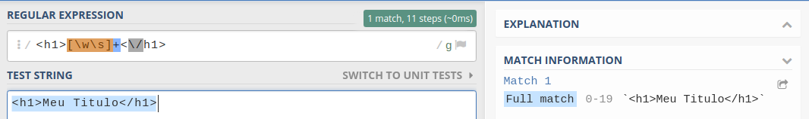
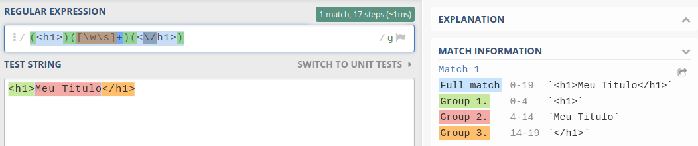
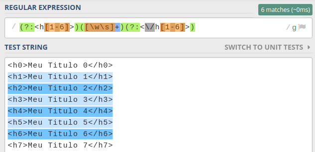
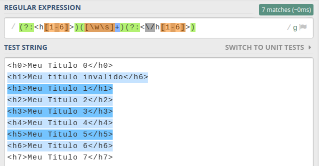
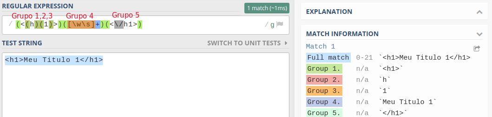
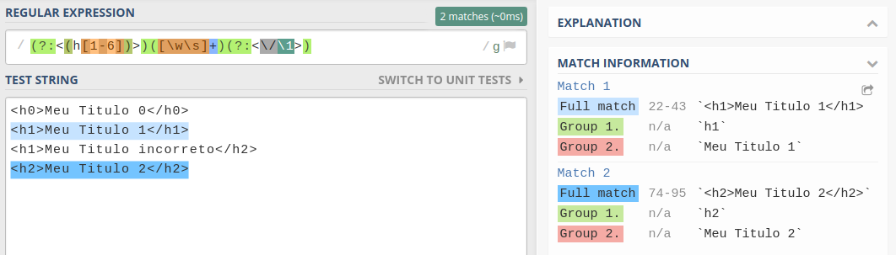

Filhos(as) de [Zion](https://matrix.fandom.com/wiki/Zion), tudo na paz? Continuando nossa saga nas Expressões Regulares, hoje iremos abordar uma funcionalidade que começa a dar vida e trazer uma real utilidade para as nossas expressões: Grupos de caracteres.

Então, liga teu [white noise](https://pt.wikipedia.org/wiki/Ru%C3%ADdo_branco) e teu [pomodoro](https://pt.wikipedia.org/wiki/T%C3%A9cnica_pomodoro) e vamo que vamo!

---

## Grupos de Caracteres: o que são?

Grupos de caracteres em expressões regulares são formas de agrupar expressões. Com eles, podemos selecionar o que queremos ou não receber nos resultados.

Até agora, estamos definindo expressões sem grupo e quando temos um _match_, é no resultado inteiro da expressão. Mas… e se quisermos pegar só um pedaço daquela expressão? Só uma parte em específico e o resto podemos até descartar?

É justamente pra isso que serve o grupo. Observe o target abaixo:

```html
<h1>Meu Titulo</h1>
```

Vamos imaginar que queremos pegar o valor do **título** entre as _tags_. Assim, podemos pensar da seguinte forma:

- Preciso definir que eu quero que venha um h1: `<h1>`
- Como eu não sei o que virá no titulo, quero que apareça qualquer letra ou número (word character) `\w` e também espaços em branco `\s`, 1 ou mais vezes: `[\w\s]+`
- Por fim, fechamos a _tag_ h1: `<\/h1>`

Resultado:

```txt
<h1>[\w\s]+<\/h1>
```



Mas, não era bem o que a gente queria né? Queremos só o conteúdo do titulo e não as _tags_ que ele está inserido.

---

## Utilizando os grupos

Para definir um grupo de caracteres, basta escrever uma expressão entre parênteses (`()`). Dessa maneira, começaremos a receber como resultado os valores do grupo, não só o _full match_ como estamos acostumados.

Continuando no exemplo do **título**, vamos separar cada bloco de código por grupos:

- `<h1>` = `(<h1>)`
- `[\w\s]+` = `([\w\s]+)`
- `<\/h1>` = `(<\/h1>)`

Resultando em:

```txt
(<h1>)([\w\s]+)(<\/h1>)
```



Viu só? Agora além de recebermos o valor _full match_ da expressão, recebemos também valores de cada **grupo** que definimos. E é aqui que a coisa começa a ficar interessante pra valer!

> Mas Raul, a gente não queria **somente** o valor do título? Por que tá vindo as _tags_ ainda?

Calma Jovem! A gente vai descobrir isso agora.

---

## Non-capturing group

Como vimos no nosso exemplo, agora estamos pegando os valores dos grupos. Mas como solicitar à Regex Engine para que **NÃO** traga o valor de algum grupo? Para faze-lo, basta no início do grupo digitar `(?:)`.

Assim, corrigindo a nossa expressão, temos:

```txt
(?:<h1>)([\w\s]+)(?:<\/h1>)
```

E como resultado temos:


Como escapamos o valor dos grupos das _tags_, agora só temos o _full match_ e o resultado do conteúdo da nossa _tag_ h1.

---

## Diferentes cenários

Atingimos o nosso objetivo, mas, vamos um pouco mais afundo nisso.

Imagine que além de validar a _tag_ `h1`, queremos considerar todos os tipos de titulo (de 1 a 6).

Bem, já sabemos fazer isso né? Basta utilizar uma classe de caractere, passando que queremos de 1 até 6:

```txt
<h[1-6]>
```

Alterando nossa expressão, temos:

```txt
(?:<h[1-6]>)([\w\s]+)(?:<\/h[1-6]>)
```

Resultando em:



Conseguimos deixar um pouco mais dinâmico… Mas… como já diria o poeta:

<BigQuote>“Algo errado, não está certo!” — desconhecido</BigQuote>

Talvez você tenha percebido que temos uma possível falha em nossa expressão. Da maneira que está definida, dizemos que:

> Queremos pegar os valores entre as _tags_ h (de 1 a 6) de abertura e fechamento!

Porém, observe o caso abaixo:

```html
<h1>Meu titulo inválido</h4>
```

Todos nós sabemos que a _tag_ de fechamento **deve** ser a mesma de abertura. Caso não seja, é um elemento inválido! Entretanto, olha o resultado da nossa expressão:



<Gif
  src="https://media.giphy.com/media/co5nmPivPa42vv6IVm/giphy.gif"
  caption="Chega, não da mais."
></Gif>

Calma, calma, calma. Tem solução!

---

## Backreferences

Backreference é uma forma de fazer **referência** à um grupo que **já** foi informado anteriormente, ou seja, é uma forma de dizer à engine que queremos fazer referência (ter o mesmo valor aqui) do grupo “n”.

> Grupo n? Que história é essa?

### Número do grupo

Cada grupo que definimos ganha um número, que no caso seria sua posição na expressão. Esse número, varia conforme a ordem de declaração, ou seja, o primeiro grupo ganha o número 1, o segundo ganha o número 2 e assim sucessivamente.


Vale deixar claro que o que determina a ordem e os números de cada grupo é a ordem de precedência, ou seja, se tivermos grupos dentro de grupos, a regex irá definir todas os grupos daquele aninhamento e depois continuará para os outros que estão fora:



Fazendo uma analogia, lembra das aulas de matemática, onde temos várias expressões aninhadas e precisamos resolver de fora pra dentro? É a mesma coisa:

```txt
1+((3*4)+2) = 1+(12+2) = 1+14 = 15
```

> **Atenção**
> Vale comentar um comportamento que pode fazer a gente quebrar muito a cabeça e acreditar que estamos fazendo algo errado.
>
> Quando definimos que o grupo será “non-capturing” (?:), além dele não aparecer nos resultados, ele também **não ganha uma numeração**. Ou seja, você não conseguirá fazer referências à ele. =/

### Fazendo referência à um grupo

Sabendo como é definido os números, para podemos definir que queremos o **mesmo** valor do grupo “n”, basta saber o seu número e passarmos com a barra invertida (`\`).

Voltando pra resolver o último exemplo, queremos que quando a _tag_ de abertura for `h1`, a _tag_ de fechamento também seja `h1`. Com o conceito de backrefence em mente, definiremos que o `h[1-6]`:

```txt
(?:<(h[1-6])>)
```

Agora, faremos a referência a ele. Como na ordem de precedência ele é o grupo número 1 (devido ao fato de termos negado o pai), declaramos nosso que o backreference é igual a \1 :

```txt
([\w\s]+)(?:<\/\1>)
```

Juntando as duas partes:

```txt
(?:<(h[1-6])>)([\w\s]+)(?:<\/\1>)
```

Resultando em:



Perceba que agora blindamos a nossa regex contra um comportamento estranho. Infelizmente recebemos um grupo não desejado, mas é o preço da referência por números.

De qualquer forma, nosso objetivo foi alcançado!

<Gif
  src="https://media.giphy.com/media/F9hQLAVhWnL56/giphy.gif"
  caption="Conseguimos, uhul"
  imgStyle="max-width: 300px;"
></Gif>

---

## Conclusão

Ainda há mais algumas formas de fazer referência, como por exemplo por [nome](www.regular-expressions.info/named.html). Entretanto, essa funcionalidade não é comum em todas as engines.

Grupos nos permitem dar uma complexidade e flexibilidade às nossas expressões. Assim, tenha em mente: Sempre que precisar pegar algum resultado específico, **utilize grupos**!

Espero que tenha aprendido sobre o tema e até a próxima! =D
