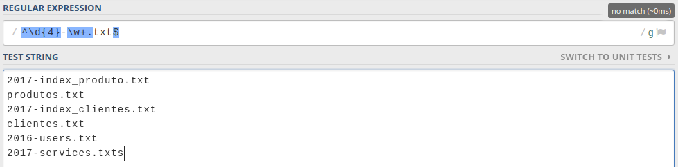

Fala meu povo, tudo bem com vocês? Estamos quase fechando a série “Entendendo de uma vez por todas Expressões regulares”.

Hoje iremos abordar um tema que pra mim, é um dos mais difíceis no que tange à Regex: Âncoras. Mas antes, se você acabou de chegar por aqui e quer acompanhar desde o primeiro tópico, sugiro acessar o primeiro artigo ([introdução](/pt-br/2017/05/regex-part-1)).

Chega de papo e vamos ao que interessa.

---

## Mas, o que são?

Bom, no geral, âncoras servem para que você delimite um começo e um fim em uma expressão regular. Basicamente você diz que a correspondência dessa expressão deve começar e terminar daquele jeito, e caso não corresponda, já seja descartada.

Um pouco abstrato né? Vamos olhar esta _string_ de teste bem simples:

```txt
aaa aaaa aaa aa
```

Se quiséssemos filtrar correspondências de 3 “a”, escreveríamos uma regex similar a:

```txt
a{3}
```

Porém, vamos observar o resultado:


Perceba que filtramos 3 “a” até do segundo conjunto, onde há 4. Mas pegamos apenas 3. E é exatamente nos casos onde não queremos que essa correspondência ocorra que usamos as **âncoras**.

---

## Tipos de âncoras

Existem algumas formas de definir âncoras, mas independentemente de qual o tipo, elas sempre terão um mesmo padrão:

```txt
âncora inicio + expressão + âncora fim
```

### Word boundary

Esse tipo de âncora é definido pela expressão \b . Ela indica que você deseja buscar uma expressão que **não comece** e **nem termine** com letras.

Voltando no nosso exemplo simbólico, podemos usar esse tipo de âncora para resolver o problema:


Perceba que agora temos exatamente as correspondências que queríamos, pois, agora que definimos que a expressão não pode terminar com uma letra, ele descarta o caso `aaaa`.

### O inverso

Como já comentei nos tópicos anteriores, em Regex, geralmente quando queremos fazer uma negação, usamos a letra maiúscula, ou seja, se eu digo que não quero que minha regex comece ou termine com letras e números usamos `\b`, mas para dizer o contrário — que sim, queremos — basta utilizarmos o `\B`.

Ainda no exemplo anterior, combinado o `\b` com `\B`, podemos ter o seguinte resultado:


Perceba que agora definimos que a nossa expressão PODE começar com um caractere, mas não pode terminar, tanto isso é verdade que o ultimo conjunto (`aaaab`) não é selecionado.

---

## Início e Fim

Ainda temos âncoras que definem um início e um fim em nossas expressões, ou seja, o target (_string_ alvo) avaliado deve começar e terminar daquela forma, caso contrário, não teremos um match.

Esse tipo de âncora é definido por `^` e por `$`, sendo o primeiro usado no início da expressão e o segundo no fim:

```txt
^<minha-expressão>$
```

Para visualizar melhor o comportamento deste, vamos pensar em um caso hipotético:

Tenho uma aplicação que precisa fazer uma busca em uma pasta cheios de arquivos de extensão TXT, e queremos filtrar um padrão especifico de nomenclatura dos arquivos. Digamos que essa nomenclatura seria algo:

```txt
ano-nome_do_arquivo.txt
```

Quando fazemos a leitura dos arquivos na pasta, receberemos uma lista similar a essa:

```txt
# Target

2017-index_produto.txt
produtos.txt
2017-index_clientes.txt
clientes.txt
2016-users.txt
```

Bom, como eu sempre gosto de fazer, vamos montar a regex por partes:

- Para pegar o ano: `\d{4}`
- hífen obrigatório: `-`
- Nome do arquivo pode ter letras, números e underline (`_`) 1 ou + vezes: `\w+`
- extensão obrigatória: `.txt`

Juntando tudo, temos:

```txt
\d{4}-\w+.txt
```

E como resultado:


Entretanto, temos uma pequena falha nessa abordagem. Digamos que um arquivo com extensão `.txts` seja colocado na pasta. Na hora de buscar os nomes dos arquivos, pegaríamos ele também:


Deu ruim!

Bom, não queremos então que os nossos matches comecem e terminem dessa maneira? Nem mais nem menos? Então vamos usar âncoras de **início** e **fim**:

```txt
^\d{4}-\w+.txt$
```




Eita… Calma.

## Comportamento

Como eu disse anteriormente, o comportamento da âncora de **início(^)** e **fim(\$)** é definir que não teremos MAIS NADA antes e nem depois, mas, implicitamente, o nosso alvo avaliado (_string_ de nomes de arquivos) possui uma quebra de linhas e esse é o motivo de simplesmente não ter funcionado.

Infelizmente, cada engine (motor) trata essa quebra de linhas de uma forma diferente. Caso você não seja da turma do Javascript, sugiro dar uma olhada como a engine da sua linguagem favorita trata isso.

Além da nossa expressão, podemos passar flags que são basicamente configurações no modus operandi do moto da Regex. A flag `/g` indica que essa expressão pode se repetir várias vezes, ou seja, ela terá o comportamento de encontrar todas as correspondências no nosso alvo. Já a flag `/m` indica que queremos considerar quebras de linhas.

No mundo Javascript, para aplicar essas flags você deve definir no fim da expressão. Entrarei em mais detalhes no próximo artigo.

Por padrão, já estamos usando o `/g` , e agora combinaremos o `/m` para consertar nosso exemplo anterior:


Pronto, problema resolvido e casos tratados!

---

## Conclusão

Hoje vimos um tópico que na minha opinião é um dos mais complicados de entender e aplicar, pela variedade imensa e comportamentos diferentes em cada caso, mas sem dúvida alguma, muito útil para resolver alguns problemas específicos. Espero que tenha ficado claro seu propósito e seu uso.

Caso tenha alguma dúvida ou sugestão de correção, fique à vontade para comentar aqui ou interagir comigo das redes sociais.

Obrigado pela leitura e até mais!
