Fala dev's, tudo bom com vocês? Hoje vim falar de um tema que me fez bater muito a cabeça quando estava começando no mundo da programação (mais especificamente no mundo front-end):

> "Terminei um projeto e quero colocá-lo no ar. Comofas?".

Espero que este tutorial possa ajudar desenvolvedores Front-end no geral, mas, principalmente, os iniciantes, que geralmente estão cercados de dúvidas como esta.

---

## Servindo online

Como eu disse na introdução, na cabeça de quem está começando, servir um site é sempre um problema. Lembro-me de quando eu comecei a mexer com desenvolvimento web e, naquela época, eu só tinha sido apresentado à forma de subir sites na Hostgator e usando PHP (oi?).

Mas, poxa, não queria usar PHP, eu só queria subir meu index.html + index.css + index.js e ser feliz. Será que era pedir muito?

<div style="width:100%;height:0;padding-bottom:56%;position:relative;"><iframe src="https://giphy.com/embed/3ohzdDls6viEANKHtK" width="100%" height="100%" style="position:absolute" frameBorder="0" class="giphy-embed" allowFullScreen></iframe></div>

Depois de ficar um bom tempo tentando resolver esse problema eu acabei ficando de saco cheio e desisti. Algum tempo depois, eu estava procurando procurando formas de modularizar meu HTML e acabei caindo em um curso de [Jekyll](https://jekyllrb.com/) de um desenvolvedor front-end que eu admiro muito, o [Willian Justen](https://twitter.com/Willian_justen). Nesse curso, além dos conceitos de Jekyll, ele ensina como rodar o site gerado na plataforma do Github Pages (caso tenha interesse no curso, ele está [disponível gratuitamente](https://www.udemy.com/criando-sites-estaticos-com-jekyll/) na plataforma da Udemy).

<div style="width:100%;height:0;padding-bottom:54%;position:relative;"><iframe src="https://giphy.com/embed/l0ErQJblvX9EWNQCA" width="100%" height="100%" style="position:absolute" frameBorder="0" class="giphy-embed" allowFullScreen></iframe></div>

### Disclaimer rápido

Usar o Jekyll para resolver aquele problema foi o pior over-engineering de toda a minha experiência. Foi como abrir um cerveja com um martelo. Funcionou, mas era errado de várias formas diferentes. Não façam isso em casa!

---

## Github Pages

### Pré-introdução

Antes de falar sobre o Pages, gostaria de comentar sobre o Github. Se você é desenvolvedor (ou pretende ser) e não usa o Github, eu recomendo fortemente que você repense essa situação. O Github vai além de uma simples plataforma para versionar seus projetos, ele é como se fosse o Facebook (ou LinkedIn) dos desenvolvedores, ou seja, uma rede social, onde conseguimos criar nossas próprias coisas, seguir pessoas, seguir projetos, comentar nos projetos alheios, contribuir com eles, receber contribuições, enfim, ele é o lugar onde conseguimos ter contato com a comunidade de desenvolvimento do mundo todo!

Então, se você ainda não usa, crie uma conta lá e comece a usar porque vale muito a pena. E não deixe de colocar seu código online por vergonha ou medo de ter feito algo errado. Apenas lembre-se:

<big-quote>Não sinta vergonha de ser iniciante ou de errar. Os melhores um dia já o foram, já erraram e ainda erram! =p</big-quote>

---

### Sobre a plataforma

O Github Pages é uma ferramenta oferecida pelo próprio GitHub para prover seu site estático, ou seja, basicamente ele te fornece um servidor e um domínio gratuitamente para que você exiba seu site/aplicação _web_. Caso queira saber com detalhes sobre ela, você pode acessar diretamente a página deles https://pages.github.com/.

## Mão na Massa

Para que você seja capaz de realizar esse tutorial ou para que possa fazer algum sentido na sua cabeça, é necessário atender a alguns requisitos básicos:

- Saber/entender o mínimo de Git;
- Ter uma conta no GitHub;
- Ter alguma ferramenta de Git instalada no seu computador;
- Ter vontade!

Caso você ainda não tenha esse domínio, novamente eu indico um curso do Willian sobre Git/GitHub (já adianto que não são a mesma coisa) totalmente gratuito. Você pode acessar [aqui](https://goo.gl/b4gUdU). Quando terminá-lo, volte aqui que tudo fará mais sentido.

### Como funcionará?

Vou dividir o tutorial em dois níveis. O primeiro vai ser bem básico e totalmente voltado para iniciantes, onde utilizarei uma ferramenta gráfica para git para auxiliar na execução do processo.

No segundo nível, o foco será em usuários intermediários/avançados onde abordarei o mesmo projeto, porém, utilizando conceitos de pasta de distribuição e _npm scripts_ com um pacote chamado [gh-pages](https://www.npmjs.com/package/gh-pages).

Sinta-se a vontade para pular entre os níveis e lembre-se que no fim teremos **considerações finais**! =p

---

## Nível 1: Iniciante

### Criando o repositório

Bom, como já disse nos requisitos, precisamos ter uma conta no GitHub. Caso você não tenha, corre lá e faz uma.

Em seguida, precisamos ter um repositório. Para tal, basta acessar sua home no GitHub e clicar no botão `New repository`:


Preencha o **nome** do seu projeto em `Repository Name` e em seguida clique em `Create repository`:

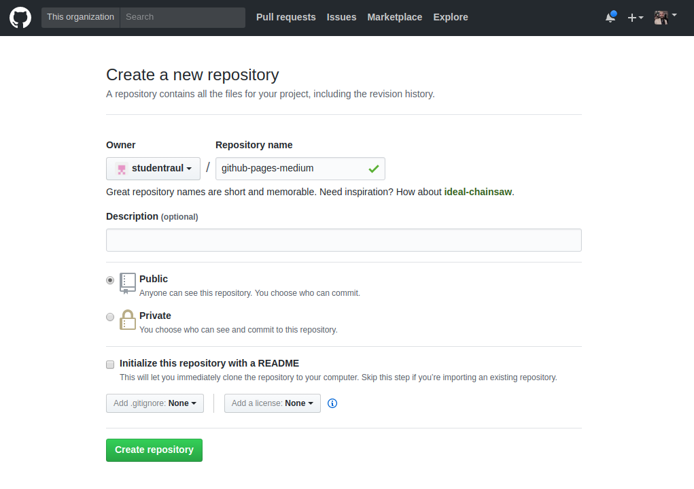

E, ao fazê-lo, você cairá em uma página semelhante a essa:

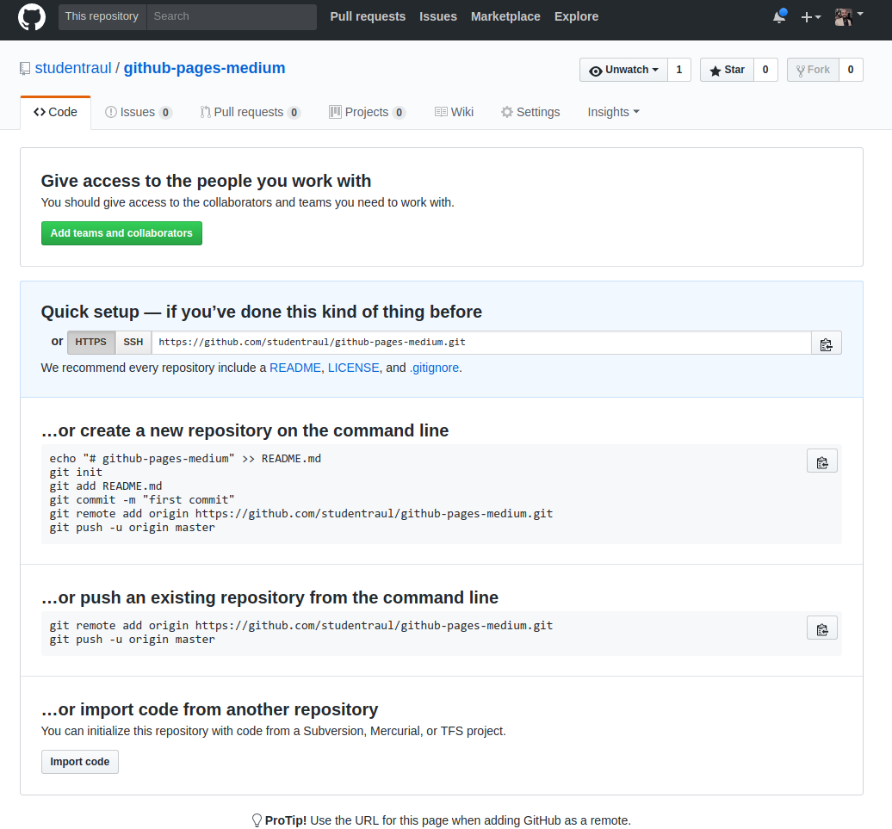

## Criando a pasta e os arquivos

Para esse projeto, criei 3 arquivos ( `index.css`, `index.html`, `index.js`) apenas para usar como exemplo em uma pasta chamada `github-pages-medium`:


Veja o resultado e o código abaixo:

<div style="width:100%;height:0;padding-bottom:54%;position:relative;"><iframe width="100%" height="300" src="//jsfiddle.net/raulfdm/ekhhukkL/embedded/js,html,css,result/dark/" allowfullscreen="allowfullscreen" allowpaymentrequest frameborder="0"></iframe></iframe></div>

## Iniciando o versionamento

Nessa parte, você poderá utilizar a ferramenta que preferir, uma vez que todas elas seguem basicamente a mesma linha.

Eu utilizarei o Gitkraken por ser gratuito para uso não-comercial e ter um visual fácil, intuitivo e impecável. Então, caso queira, faça o download no [site oficial](https://desktop.github.com/) para a sua plataforma e em seguida a instalação.

> Update de 2020: O Gitkraken tem uma limitação para projetos privados. Uma alternativa é usar a própria [app do Github para desktop](https://desktop.github.com/).

Instalado o Kraken, abra-o e faça o login com a sua conta no github.

Em seguida, clique no ícone de pasta no canto superior esquerdo para abrir um novo projeto. Em seguida clique em `Open a Repository` e selecione a pasta do seu projeto:

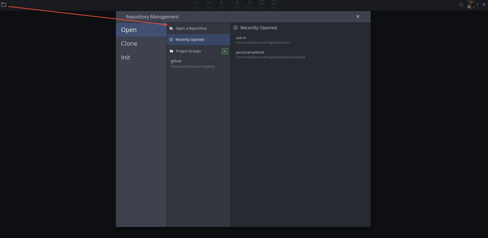

Como ainda não inicializamos o git no nosso projeto, dará uma mensagem de erro informando que não foi possível encontrar o git e se desejamos inicializa-lo:


Basta apenas clicar em `Initialize` e uma tela parecida com essa aparecerá:

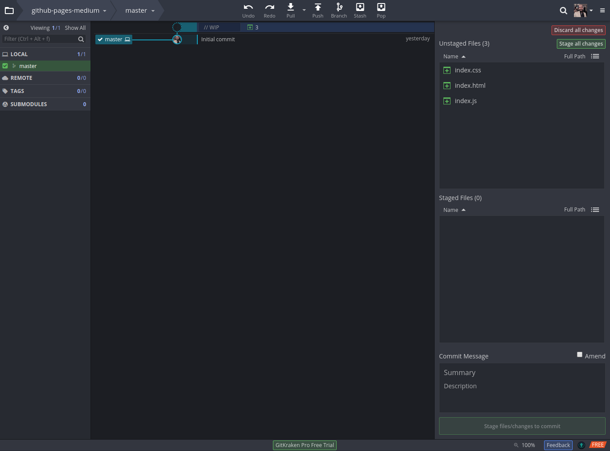

Podemos ver que nossos 3 arquivos estão com status de WIP (_work in progress_), ou seja, no fluxo do git, eles não estão sendo trackeados ainda. Dessa maneira, precisamos fazer o versionamento dos mesmos.

Para tal, no canto superior direito, clique em `Stage all changes` (o que seria o mesmo de fazer um `git add .`). Depois, na sessão de _"Commit Message"_, escreva um titulo e uma descrição.

Como este é um exemplo básico, escreverei apenas um titulo simples e não muito descritivo para representar esses novos arquivos, mas lembre-se, é uma boa prática no versionamento explicitar o que foi feito/propósito do seu commit para que seja possível identificar facilmente o que foi feito.

Após digitado o titulo, clique no botão `Commit Changes`. Perceba que agora nossos arquivos saíram de WIP e passaram a representar o estado atual do nosso projeto!


Bom, até esse ponto, estamos no nosso branch principal (master) e como pode ser visto no menu da esquerda, temos ele apenas localmente. Precisamos mandar essas alterações para o nosso repositório online no GitHub.

Para isso, precisamos primeiro adicionar um repositório remoto. No menu Remote, clique no Botão de + (`Add Remote`):


Uma tela similar a essa aparecerá:


Aqui temos 3 opções, porém apenas duas interessam. Caso você tenha entrado com a sua conta do GitHub e ela esteja conectada corretamente, você pode clicar na sessão _GitHub.com_, procurar o repositório que criou para o projeto e adicioná-lo.

No meu caso, _~por bugs do destino~_, meus repositórios não estão aparecendo nesta sessão, assim, adicionarei a URL manualmente.

Lembra quando criamos o nosso repositório no GitHub? Ele nos dava 2 links para fazer esse processo, um _HTTPS_ e outro _SSH_. Não convém entrar em detalhes sobre ambos, basta saber que quando adicionarmos um link _HTTPS_, precisaremos informar usuário e senha a cada iteração com o repositório (Caso utilize o Kraken, poderá acionar uma flag de _"Remember me"_). Já o _SSH_ é como se tivéssemos uma chave de segurança que você precisa registrar no servidor do Github para dizer que **você** é **você** mesmo.

Para fins didáticos, selecionarei o link _HTTPS_:


Copie o link e volte para o Gitkraken. Digite o nome do seu repositório que comumente é chamado de `origin` e cole o link copiado anteriormente no campo _Pull Url_ e em seguida _Add Remote_:

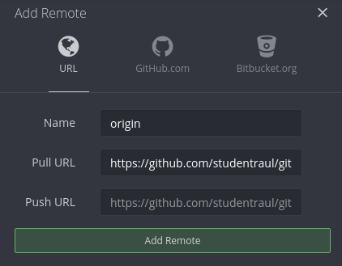

Perceba que após realizado essa adição, no nosso menu de Remotes, agora temos um item:

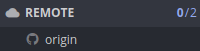

Finalmente mandaremos os nossos arquivos para o nosso repositório no Github. Clique no botão Push:

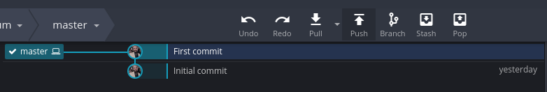

Por se tratar do primeiro Push, uma mensagem perguntando para qual _branch_ remoto deveria ser enviado essas alterações. Como o _branch_ inicial é o Master, ele será o valor default. Clique em `submit`:


Você receberá uma mensagem falando se deu certo ou não sua submissão. Caso tenha tudo ocorrido com sucesso, podemos checar o nosso repositório no GitHub:


---

## O que interessa (finalmente)

> "Raul, tudo isso foi bem legal, mas, e aquela história de colocar o site online?"

Então, agora é a parte mais fácil. Lembra quando iniciamos o git no nosso projeto e o _branch_ master foi criado? Inicialmente, ele representa os arquivos na última versão estável do nosso projeto, logo, o GitHub por default entende que é ele quem deve ser mostrado ao acessar o projeto, ou seja, nossa página principal.

Em paralelo a isso, o GitHub também entende que se a gente tiver um _branch_ chamado `gh-pages` os arquivos que nele estão, deverão ser servidos como a partir de um servidor web, tendo como ponto de entrada o arquivo `index.html`.

### Criando o branch gh-pages

Para criar o branch, no menu esquerdo e sessão "Local", passe o mouse sobre o master, clique nas opções (3 pontos verticais) e selecione a opção `Create branch` here:

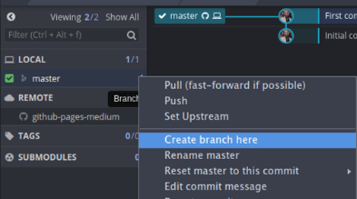

Irá aparecer um campo para você digitar o nome. Digite `gh-pages` e aperte **Enter**.

Feito isso, o _branch_ `gh-pages` será criados e o mesmo será definido como nosso atual local de trabalho (famoso checkout):

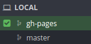

Novamente temos um branch Local (em nosso computador), mas não remoto (no servidor). Dessa maneira, precisamos fazer de novo o procedimento de _Push_ para o nosso repositório no GitHub e já sabemos faze-lo.

Ao clicar em _Push_, aquela mensagem de _"Para qual branch essas alterações devem ser enviadas"_ irá aparecer novamente. Como o nome do nosso branch já é `gh-pages`, basta clicar em **Submit**.

Após receber a mensagem de sucesso, podemos conferir se o nosso branch realmente foi enviado indo na página do nosso projeto (não esqueça de dar um F5, hein?)


Para facilitar a troca de exibição, clique no botão `Branch` e selecione o nosso novo branch:


Mas pera…

<div style="width:100%;height:0;padding-bottom:56%;position:relative;"><iframe src="https://giphy.com/embed/jzmW5lHbV456E" width="100%" height="100%" style="position:absolute" frameBorder="0" class="giphy-embed" allowFullScreen></iframe></div>

> CADÊ MEU SITE?

Calma, xófem… respira…

## Truque da URL

Como eu disse anteriormente, o GitHub tem várias macetes inteligentes. Para você acessar seu site a partir do branch gh-pages , existe o seguinte macete:

Atualmente a URL para acessar o seu repositório é dado por:

```md
https://github.com/**seu-usuário**/**nome-do-seu-repo**
```

Como por exemplo:

```md
https://github.com/**studentraul**/**github-pages-medium**
```

Então, para acessar o seu site estático de qualquer repositório que o tenha a URL segue o padrão

```md
https://**seu-usuário**.github.io/**nome-do-seu-repo**
```

Que no nosso caso será

```md
https://**studentraul**.github.io/**github-pages-medium**
```

E vamos ver se deu certo?

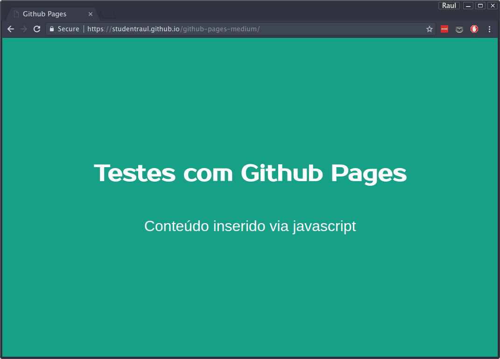

<div style="width:100%;height:0;padding-bottom:58%;position:relative;"><iframe src="https://giphy.com/embed/xT9IgOoJe1q8D9cRsk" width="100%" height="100%" style="position:absolute" frameBorder="0" class="giphy-embed" allowFullScreen></iframe></div>

---

## Uma outra abordagem

Como se pode notar, a primeira abordagem que fiz aqui sobre o tema é 100% funcional. Entretanto, existe alguns pontos de atenção e até reflexões acerca.

### Arquivos desnecessários

Fizemos uma cópia do master para o _gh-pages_, entretanto, o _branch_ do _gh-pages_ é o nosso servidor. Não é uma boa prática poluir nosso servidor com arquivos que não serão utilizados na versão final, ou seja, na exibição da nossa página, como é o caso do _README.md_, que apesar de fazer muito sentido no master (informar do que se trata nosso projeto), no _gh-pages_ não tem utilidade.

Imagine o seguinte cenário:

Você está fazendo um site para um cliente e por motivos contratuais, não pode expor o código de desenvolvimento publicamente. Entretanto, você gostaria de poder usufruir dessa ferramenta maravilhosa. Como você já sabe como usar, você conversa com seu cliente e ele concorda que o arquivo de produção poderá ser subido publicamente para um repositório no Github, uma vez que a sua exibição terá um custo total de R\$ 0,00. O que fazer?

### Somente gh-pages

Quem já domina um pouco mais sobre o desenvolvimento front-end, sabe que antes de mandar um código pra produção precisamos realizar várias tarefas como por exemplo:

- minificar arquivos JS, CSS e até mesmo o HTML;
- minificar imagens;
- Caso você utilize JavaScript moderno (ES6^) você precisa transpilar esse código para ES5 - manter compatibilidades;
- Caso você utilize algum pré-processador CSS (sass/less/stylus/etc) você precisa gerar - código CSS;

Depois de rodar tudo isso, você terá um código de produção, totalmente otimizado e que geralmente é colocado na pasta `/dist` ou `/prod` (ou como você queira chamar) e aí sim, esses arquivos finais serão servidos online.

Dessa maneira, uma opção é pegar esse código da produção e ao invés de criar o branch master, criar direto o gh-pages. Com isso, você terá apenas um branch com o código totalmente ofuscado.

---

## Nível 2: Intermediário/Avançado

Caso você seja mais experiente e já use pacotes npm, vou ensinar uma abordagem um pouco mais direta utilizando um pacote chamado [gh-pages](https://www.npmjs.com/package/gh-pages).

Basicamente ele abstrai toda essa questão de criar o branch do gh-pages no repositório do GitHub e além disso, você pode definir qual é a pasta será enviada. Isso ajuda muito caso tenhamos uma pasta com os arquivos de produção.

### Requisitos para esse tutorial

Como esse é um tutorial um pouco mais avançado e o objetivo não é detalhar cada conceito a fundo, alguns conceitos/ferramentas são necessários:

- Saber o que é um projeto npm e como usá-lo;
- Ter o NodeJS e npm instalados no seu computador;
- Saber instalar uma dependência;
- Traquejo básico do terminal (navegar entre pastas e digitar comandos);

Se estiver tudo Ok, vem comigo! =)

### Iniciando o projeto

Primeiro de tudo, precisamos iniciar um projeto npm dentro do nosso projeto atual. Logo, abra um terminal na pasta do seu projeto e digite:

```bash
npm init
```

Responda todas as perguntas (ou dê enter em tudo) e no final você terá um arquivo `package.json` similar a esse:

```json
{
  "name": "github-pages-medium",
  "version": "1.0.0",
  "description": "Repositório exemplo para o artigo sobre subir projetos front-end",
  "main": "index.js",
  "scripts": {
    "test": "echo \"Error: no test specified\" && exit 1"
  },
  "repository": {
    "type": "git",
    "url": "git+https://github.com/studentraul/github-pages-medium.git"
  },
  "keywords": ["front-end", "projeto", "exemplo", "medium", "artigo"],
  "author": "Raul Felipe de Melo",
  "license": "MIT",
  "bugs": {
    "url": "https://github.com/studentraul/github-pages-medium/issues"
  },
  "homepage": "https://github.com/studentraul/github-pages-medium#readme"
}
```

### Instalando o gh-pages

Agora, precisamos adicionar o pacote `gh-pages` como dependência de desenvolvimento do nosso projeto. Digite o comando:

```bash
npm install --save-dev gh-pages
```

### Organizando o projeto

Como pode ser observado, agora temos vários arquivos no nosso projeto que não fazem o menor sentido de ir para o branch do `gh-pages`, uma vez que o importa mesmo é o html + css + js:


Agora vamos criar uma pasta `/dist` e fazer uma cópia dos arquivos que realmente precisam ir pra produção (`index.css` , `index.html`, `index.js`):

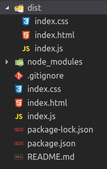

Como se trata de um projeto com fins educativos, não adicionarei nenhum tipo de automatizador de tarefas nem nada do tipo, apenas fiz uma cópia simples dos arquivos que já tínhamos para a pasta `/dist`.

### Usando o comando gh-pages

Para rodar o CLI (command Line interface) do gh-pages, precisamos acessar o seu executável dentro da pasta do node_modules e podemos fazer isso através do comando:

```bash
npm run gh-pages
```

Agora, basta passar o comando `-d` (ou `--dist`) que tem a ação de executar todo o processo de publicação no pages e qual informar qual pasta que deverá ser enviada para o nosso repositório `gh-pages`:

```bash
npm run gh-pages -d dist/
```

Por de baixo dos panos, ele vai ler todo o conteúdo da sua pasta, e mandar em formato de commit para o seu branch remoto (no servidor do GitHub) esses arquivos.

Aguarde alguns segundos e você receberá uma mensagem informando que foi feito a publicação:

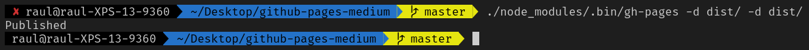

Conferindo o nosso repositório gh-pages no GitHub, podemos ver que realmente funcionou, uma vez que o arquivo README.md estava anteriormente em nosso repositório e não está mais, pois, o mesmo não existe na pasta `/dist`, ou até mesmo através da sessão de _commits_:


---

## Adicionando npm scripts

Venhamos e convenhamos que digitar esse comando gigante toda hora que precisamos enviar é um saco né? Para facilitar a nossa vida, vamos criar um _npm script_ chamado `publish`.

Abra o arquivo _package.json_ e no campo de scripts, crie uma nova linha com a chave de `publish` e o valor com o nosso comando de deploy:

```json
{
  "scripts": {
    "test": "echo \"Error: no test specified\" && exit 1",
    "publish": "./node_modules/.bin/gh-pages -d dist/ -d dist/"
  }
}
```

Com isso, agora podemos rodar o comando `npm run publish` para mandar nossas alterações para o repositório do gh-pages:

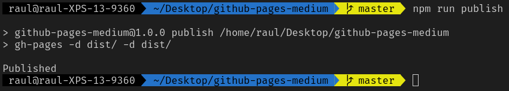

---

## Para saber mais

Caso você utilize o Gulp ou o Grunt, existem pacotes que utilizam o gh-pages:

- [grunt-gh-pages](https://github.com/tschaub/grunt-gh-pages)
- [gulp-gh-pages](https://github.com/shinnn/gulp-gh-pages)

Assim, você consegue adicionar esse processo no seu fluxo de trabalho e manter tudo em um local só.

---

## Considerações Finais

Antes de encerrar esse artigo, gostaria de comentar que caso você ainda utilize PHP para criar páginas, esta **não** é uma opção para você, uma vez que o objetivo do GitHub Pages é apenas servir arquivos estáticos.

Caso você já seja avançado e utilize frameworks como Vue, Angular, React, lembre-se que no fim, eles compilam para JS/CSS/HTML e que o resultado do seu build poderá ser servido nessa plataforma!

Concluindo, vimos que o GitHub Pages é uma opção bem interessante de host de páginas estáticas e, apesar de parecer complicado inicialmente, com o tempo você ganha familiaridade e verá que acaba se tornando algo muito trivial!

Espero ter conseguido passar a mensagem de uma forma divertida e clara, para que assim você consiga subir seus projetos e compartilhar com todo mundo! =D

No próximo artigo, falarei de outra opção um pouco mais avançada (mas muito simples) de subir seu projeto com poucas linhas de comando: Surge.

Um grande abraço.
