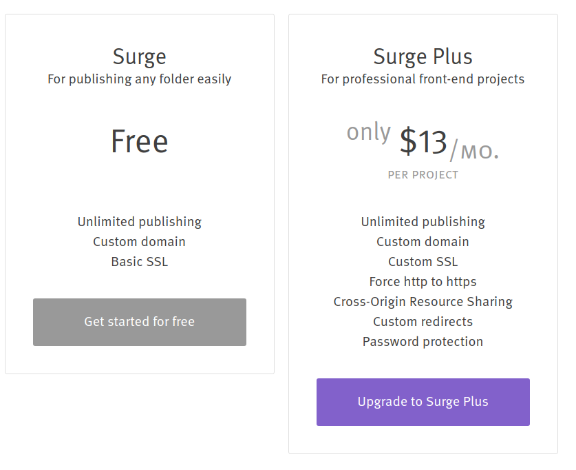
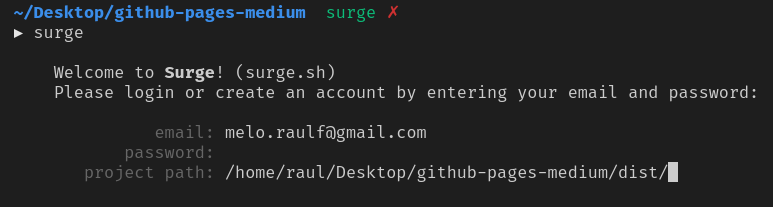
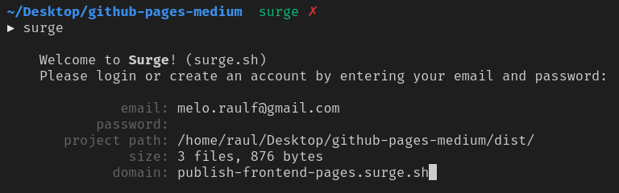
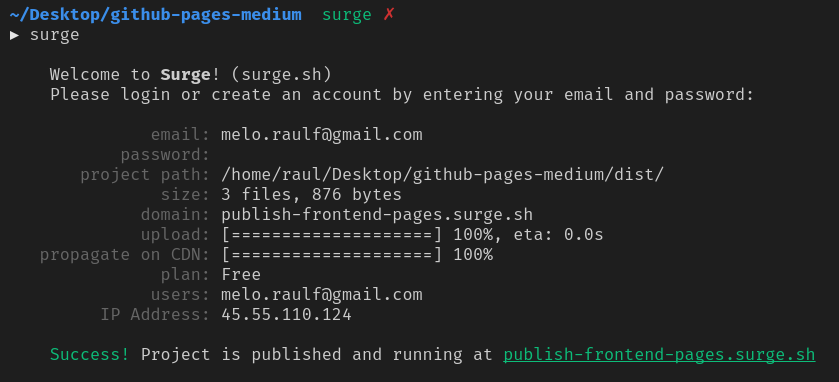
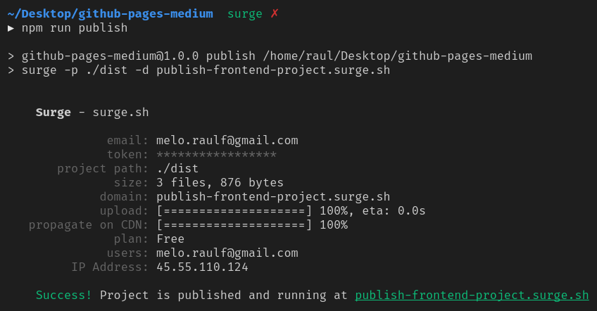
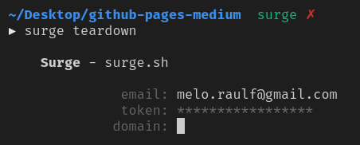
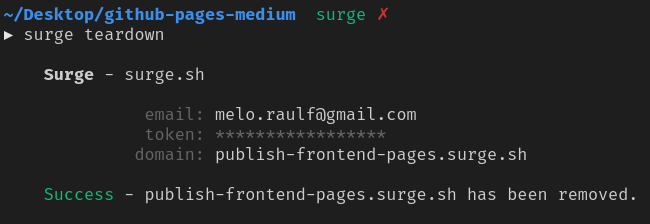

Fala Dev's, tranquilidade? Mais um artigo sobre subir seu projeto front-end gratuitamente. Dessa vez eu vim apresentar pra vocês uma ferramenta que eu vi há algum tempo atrás, mas que eu só fui testar e usar recentemente.

Se você ainda não viu o primeiro post onde eu falo sobre o GitHub Pages, você pode clicar <!-- TODO: Replace this link  -->[aqui](https://medium.com/trainingcenter/subindo-seu-projeto-front-github-pages-1b61e2e1c447) e ir direto lá!

Prepara aí que o artigo de hoje vai ser bem mais rápido!

---

## Introdução

Como havia comentado no artigo anterior, servir online de forma fácil e prática sempre foi um problema. Apesar do GitHub Pages ser bem interessante, quem leu o artigo ou o usa, sabe que não é tão trivial assim, uma vez que você precisa NO MÍNIMO, saber usar GIT, e esse fator (apesar de imprescindível), aterroriza muita gente.

Então, hoje eu apresento pra vocês o Surge, que tem na sua missão:

<BigQuote>"Publicação estática na web para devs Front-End"</BigQuote>

## A Ferramenta

Antes de mais nada, quero deixar claro que eu vou apresentar o básico da ferramenta, ou seja, apenas como subir o seu serviço. Ela possui várias opções bem interesses e um pouco mais avançadas como, por exemplo, domínio e página 404 customizável, [_clean URLs_](https://en.wikipedia.org/wiki/Clean_URL) e várias outras features interessantíssimas. Sugiro a você acessar a documentação completa ([aqui](https://surge.sh/help/)) para entender como aplicar cada feature.

O Surge surgiu com uma proposta de resolver de uma vez por todas esse problema que nós sempre enfrentamos. As vezes queremos mostrar o andamento de um projeto, mas subir online parece ser tão custoso. E é pensando nisso que ele foi desenvolvido.

Caso você tenha um pouco de noção de inglês, sugiro você ler o [post introdutório do Surge no Medium](https://medium.com/surge-sh/introducing-surge-the-cdn-for-front-end-developers-b4a50a61bcfc). Vale muito a pena.

## Preço

O Surge totalmente gratuito. E aí você pode se perguntar:

> Mas como isso é possível?

Segundo a própria equipe do Surge, os desenvolvedores se preocupam bastante com a comunidade de desenvolvimento e com plataformas Open Source. Para eles, a ideia de que **todos** possam subir facilmente seus projetos para web é muito importante (você pode ler esse pequeno [texto aqui](https://surge.sh/help/why-is-surge-free)).

Porém, nem só de amor ao open source vive um time de desenvolvedores. Assim, além da versão grátis, temos uma versão **paga**. E aí fica aquele questionamento…


### Projetos profissionais

Como você pode ver no quadro abaixo, existem algumas pequenas vantagens ao se pagar o plano mensal. Porém, acredito ser recomendado caso você seja um freelancer e esse tipo de serviço já esteja incluído no seu pacote de serviços.



---

## Como funciona

Bom, o seu funcionamento é bem simples. O Surge possui uma CLI — Command Line Interface ou em uma tradução livre, Interface de linha de comando criada em NodeJS.

Para assimilar melhor, pense em CLI como aqueles comandos que a gente roda no terminal para executar alguma ação como, por exemplo, o próprio GIT. A gente digita um comando (`git`) , passamos comandos e então e alguma será executada.

Assim, o requisito mínimo para você usar o Surge é você ter o [NodeJS](https://nodejs.org/en/) (e consequentemente o NPM) instalado na sua máquina e um terminalzinho.

---

## Mãos na massa

### Instalando o Surge

Como qualquer pacote NPM, você pode instalar o Surge localmente ou globalmente. Por questões de praticidade, vamos instala-lo globalmente:

```bash
npm install --global surge
```

> Obs.: Caso você tenha algum tipo de erro de permissão para instalar pacotes globais com o NPM, você pode seguir [este](https://docs.npmjs.com/resolving-eacces-permissions-errors-when-installing-packages-globally) tutorial do próprio NPM.

Caso prefira yarn:

```bash
yarn global add surge
```

Feito isso, o surge estará disponível para uso:


### Subindo o projeto

Como exemplo, vou utilizar o mesmo projeto que eu fiz no post sobre GitHub Pages (você pode ver o código clicando [aqui](https://github.com/studentraul/github-pages-medium)).

No terminal, já dentro da pasta do meu projeto, eu vou rodar o comando surge:


A primeira coisa que ele vai me pedir, é um e-mail e uma senha para criar uma conta.

Após a criação da conta, aparecerá o campo `project path` para que digamos exatamente qual pasta deverá ser hospedada no servidor. Ele assumirá como parte do caminho, a pasta que estamos logados (root do projeto), logo, basta digitarmos a pasta que queremos subir, que neste caso é a pasta `dist/`:



O próximo campo que aparecerá é o `domain`, ou, domínio. O Surge gera um domínio randômico para nós:



Porém, podemos colocar um domínio que condiz mais com o nosso projeto sem maiores problemas:


> Lembrando que há a possibilidade de personalizar seu domínio de forma gratuita, porém, esse tópico não será abordado neste post.

Após confirmar o `domain`, será feito o upload do seu projeto para o servidor do Surge e o mesmo já estará disponível para acesso:



Acessando o nosso domínio (publish-frontend-pages.surge.sh), podemos ver o resultado como esperávamos.

> Obs.: essa publicação será desligada do decorrer do post.


<Gif src="https://media.giphy.com/media/l42P7LGjW2aGRfvXy/giphy.gif" />

---

## Evitando erros

### Melhorando o comando

Vimos que precisamos informar duas variáveis, o caminho da projeto que subirá (`project path`) e o domínio a ser utilizado (`domain`). Como eu havia explicado sobre as CLIs, usualmente elas aceitam parâmetros. Sempre que tiver dúvida sobre quais os possíveis parâmetros, digite no terminal o nome da CLI com o comando `--help` ou `-h`.

Com a CLI do Surge não seria diferente, podemos informar de uma vez só o caminho do projeto, utilizando o comando `-p <caminho-do-projeto>` e o domínio, `-d meu-dominio.surge.sh` , ficando da seguinte maneira:

```bash
surge -p ./dist -d publish-frontend-project.surge.sh
```


Podemos ver que o efeito é o mesmo e de forma bem mais rápida.

### NPM Scripts

O passo acima foi legal, mas sabemos que digitar um comando gigante desse é sempre chato e passível de erros (talvez você não tenha percebido, mas digitei dominios diferentes entre os exemplos =p). Assim, caso você já esteja usando pacotes NPM no seu projeto, basta adicionar o comando:

```json
//package.json...
{
  "scripts": {
    "publish": "surge -p ./dist -d publish-frontend-project.surge.sh"
  }
}
```

Agora, podemos rodar o comando `npm run publish` para fazermos o update dos nossos arquivos para o servidor:



---

## Desligando um projeto

Pode ser que você tenha subido esse projeto apenas para mostrar para o seu cliente, mas queira tira-lo do ar depois disso. Existe a possibilidade de faze-lo através do comando `teardown`.

Como havia comentado, sem querer eu digitei dominios diferentes e acabei criando dois serviços. Para exemplificar o `teardown`, utilizarei o primeiro projeto (publish-frontend-pages.surge.sh).

Para realizar a remoção, basta digitar `surge teardown`:



Ele solicitará qual o domínio que será desativado e quando você aceitar, o mesmo será removido:



E agora ao tentar acessar o nosso serviço, caímos na seguinte página:


---

## Para saber mais

Como eu disse, isso é só a função principal do Surge, mas é possível fazer diversos tipos de customizações, eu recomendo fortemente que você de uma lida na documentação e veja o poderá servir pra você.

### Frameworks JavaScript

Caso você utilize algum Framework JavaScript, é possível subir o Build dele para o surge sem grandes problemas, apenas preste atenção no quesito roteamento (router) que pode ser consultado [nesta página](https://surge.sh/help/adding-a-200-page-for-client-side-routing).

---

## Conclusão

Neste artigo vimos que é possível subir quantos projetos desejarmos com apenas um comando. Espero que eu tenha resolvido esse dilema na sua cabeça de uma vez por todas, oferecendo essas duas ferramentas.

Tem alguma outra ferramenta tão fácil quanto?

Compartilha comigo para eu testar e escrever sobre! =D

Grande abraço e **#pás**.

<Gif src="https://media.giphy.com/media/JDKxRN0Bvmm2c/giphy.gif" />
