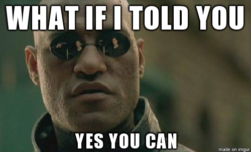

Fala dev's, tudo certo com vocês? Mais uma série de artigos começando e dessa vez eu quero compartilhar com vocês a minha história.

Ai você pode se perguntar:

<Gif
  src="https://media.giphy.com/media/3o6gaYez5IKFNoLbI4/giphy.gif"
  caption="Man, quem é tu na fila do pão?"
/>

E eu já adianto, sou apenas mais um dev tentando dar certo na vida, assim como todos vocês. Então… O que me faz pensar que eu deveria compartilhar minha trajetória?

Bom, apesar de ter 26 anos de idade, no mundo do desenvolvimento eu sou relativamente novo. Tendo em vista que eu conheço gente da minha idade que programa e tem 10 anos de experiência.

Ano que vem farão 4 anos que eu comecei a estudar pra valer pra ser um desenvolvedor. E trabalhar? Bom, se estamos falando de trabalho formal (em uma empresa por exemplo), dia 20 de Dezembro de 2017 completo meu primeiro mês de trabalho como desenvolvedor JavaScript Pleno… na **Holanda**!

Sim meus caros, meu primeiro trabalho como desenvolvedor (real oficial) foi direto fora do país, e é exatamente isso que eu quero compartilhar com vocês.

Quero fazer isso porque eu sempre me senti ruim demais pra isso, porque eu nunca pensei que estaria pronto, porque tive a dificuldade que todo mundo tem pra começar uma carreira: "O que eu preciso fazer pra conseguir um bom emprego?", "O que eu preciso estudar pra me tornar um bom profissional?", "Meu deus, tanta coisa, por onde diabos eu começo?".

Mas muito antes de tentar fazer aqueles talk shows de empreendedorismo de sucesso (no God please no) e trazer discursos motivacionais, eu quero compartilhar o que eu fiz do começo até hoje, as minhas decisões e quem sabe encorajar as pessoas que almejam seu lugar ao sol que é difícil sim, mas não impossível.

---

## TL;DR

> TL;DR é uma expressão para "Too long, didn't read", ou em pt-br, "muito longo, não li"

Caso você (seja preguiçoso/a 😆) não goste tanto de ler e sabe que não vai ter paciência pra ler, mas ainda sim ficou curioso, no final deste artigo vou dar um spoiler resumido alguns parágrafos essa história toda!

---

## Então, como vai funcionar?

Pra fazer algum sentido algumas decisões, preciso contextualizar desde a infância/adolescência até os dias de hoje, então resolvi separar por "blocos" de momentos.

Eu poderia escrever um artigo gigantesco contendo tudo, mas optei por modularizar os assuntos em artigos menores para poder dar mais detalhes e facilitar na leitura.

Sem mais delongas, são eles:

<!-- TODO: LINK ALL TEXTS HERE WHEN IT FINISHES THE MIGRATION -->

### Ato 2: Matrix origins

Nessa parte, vou abordar um pouco da minha infância, como eu era um garoto perdido na vida e com vários problemas, até minha adolescência e meu início na vida de "trabalhador brasileiro".

### Ato 3: O que você quer ser quando crescer?

- Parte 1: Colegial
- Parte 2: Pós ensino médio

Nesse tópico vou continuar falando sobre os rumos da minha vida, das indecisões de profissional, um pouco sobre a pressão social do "saber o que quer ser" e uma breve introdução de como eu me "encontrei".

### Ato 4: Vida universitária e Sistemas de informação

Decidi escrever um tópico somente pra contar minhas conclusões da minha vida universitária, falar sobre os pontos positivos e negativos de se fazer uma faculdade e levantar uma discussão da sua importância em vários aspectos da vida.

### Ato 5: Entrando na área de TI

- Parte 1: Networking e Entrevista
- Parte 2: O trabalho

Aqui, vou falar sobre como foi a migração de Auxiliar administrativo pra Técnico em suporte, minha experiência, a empresa, o mindset dos meus colegas de trabalho e as minhas frustrações.

### Ato 6: Estudos específicos, como eu fiz, faço e dicas

Neste, darei mais detalhes de como foi meu processo de aprendizado, de como eu descobri meu método de aprendizado e os meios de estudo que eu usei e uso até hoje.

### Ato 7: A jornada do inglês

- Parte 1: Aprendendo inglês no Brasil
- Parte 2: Estudando inglês na Irlanda e reflexões
- Parte 3: Inglês na área de TI e dicas de estudo

Mais um artigo que poderia ter sido um tópico, entretanto, decidi dedicar um inteiro porque:

1. ele vai ter um papel importante mais pra frente;
1. Pelo fato de saber que MUITAS pessoas tem a mesma dificuldade que eu: falta de tesão para estudar. Assim, contarei aqui sobre meu contato com a língua e como foram meus métodos pra estudar.

### Ato 8: Adeus Brasil!

Aqui falarei de como foi minha preparação pro meu Intercâmbio, desde a análise dos possíveis destinos até o meu pré embarque.

### Ato 9: Vida de intercâmbio: Irlanda

Nesse tópico vou contar como foi minha experiência, as situações, os desafios e como foi passar 7 meses morando em Dublin, na Irlanda.

### Ato 10: O plot twist: Conseguindo um emprego de Dev!

Aqui começarei finalmente a falar sobre como foi meu processo de pra conseguir meu emprego na YoungCapital. Da entrevista até o aceite!

### Ato 11: Mudando para Holanda

Essa é a parte final, onde falarei sobre como foi mudar para Holanda, um pouco dos desafios que passei e estou passando aqui e algumas reflexões finais sobre os rumos para o futuro.

---

Eu espero que essa divisão facilite a leitura e instigue você a continuar lendo, porque se no final disso tudo você tirar um insight que seja de tudo isso pra mudar sua vida, já vai ter valido a pena!

Lembrando mais uma vez: **não** estou escrevendo um GUIA, um caminho de como conseguir arrumar um emprego fora ou coisas do gênero, até porque, quem ouve o podcast [DevNaEstrada](https://devnaestrada.com.br/) ou segue pessoas que estão trabalhando fora do país sabe que pra cada pessoa foi de um jeito único, com desafios únicos!

Então, aproveite e tente tirar o máximo que você conseguir que seja bom pra você! =D

Ah, como prometido, a sessão seguinte será um resumo de alguns parágrafos de toda essa história contada de forma resumida! Caso não queira "tomar spoiler", pode ir pro primeiro artigo da série. Te vejo em breve.

---

Como prometido no TL;DR, vou resumir toda a história:

Nunca soube o que queria fazer da vida, tentei publicidade e propaganda… Sem sucesso. Comecei a fazer curso técnico em Segurança do Trabalho e no final do curso tinha certeza que não continuaria na profissão. Me matriculei em curso de engenharia de Produção, tive uma aula junto com a turma de sistemas de informação e me apaixonei pelo curso.

Vendo essa empolgação, uma professora me chamou pra mudar de curso. Mudei e sem sombra de dúvida, foi a melhor decisão da minha vida. Consegui um trabalho meses depois como analista de suporte técnico (primeiro emprego em TI) e depois de 2 anos, constatei que não seria o lugar pra mim, pois, havia começado a estudar desenvolvimento front-end e não tinha esse cargo na empresa.

Em uma estratégia de tentar trabalhar pra fora do país, me arrisquei em um intercâmbio na Irlanda, onde passei 7 meses estudando inglês, estudando programação e trabalhando em uma hamburgueria, pois, não havia conseguido um trabalho de desenvolvedor.

Ao 45 do segundo tempo, mudei meu LinkedIn pela enésima vez e consegui ser visto por um recrutador que me ofereceu trabalho em uma empresa na Holanda. Fiz o teste via Hangouts e consegui passar. Em seguida, me chamaram pra fazer o teste na empresa, onde foi me dado 4 exercícios de programação para resolver. Em seguida, tive uma entrevista com o CTO da empresa, que queria saber o que queria da vida. Fui bem em todas as entrevistas e 2 semanas depois tive a noticia que havia sido aprovado.

Fui para o Brasil ajeitar minha vida e poder me mudar com calma e em novembro de 2017 estava embarcando com destino a Holanda para trabalhar. Passado alguns perrengues com casa, acomodação e dinheiro, comecei a trabalhar na semana seguinte e fui inserido em um projeto usando React e Redux logo de cara.

Semanas depois tive o melhor feedback do meu gerente, dizendo que eu já estava em um nível intermediário/avançado muito bom e que ele queria me ajudar a alcançar um nível sênior! Hoje, assumi a frente deste projeto, estou quase alugando um apartamento e a vida parece que começou a entrar nos eixos de vez!

É isso! Se quiser saber de detalhes sobre tudo isso, recomendo seguir os outros artigos!
