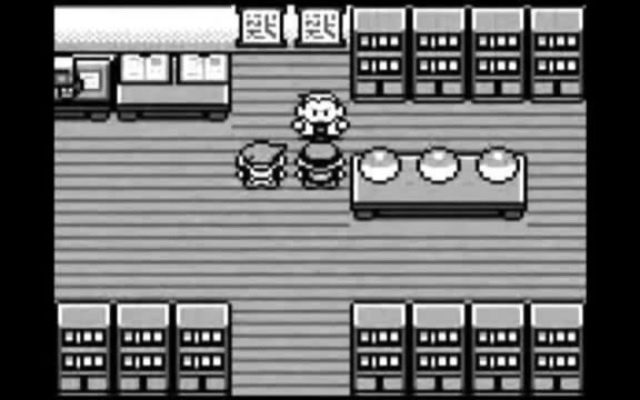
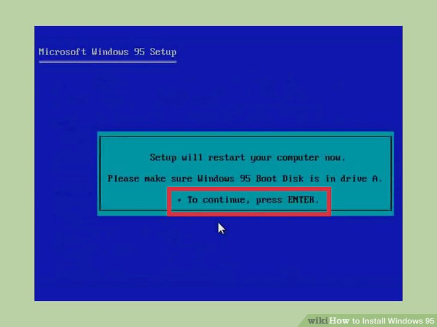

Acredito que boa parte das pessoas que trabalha ou gosta de tecnologia hoje em dia, quando era criança ficava curiosa com filmes de hackers, futuros distópicos ou até mesmo com ficções (há controvérsias) como Matrix.

Eu sempre fui uma criança muito curiosa, a ponto de abrir meus brinquedos para ver por dentro, mas infelizmente não tinha o dom de monta-los de novo 😔!

Quem tem mais de 23 anos talvez se lembre de uma época onde **tudo** era diferente. Apesar de não tão velho, me lembro de viver em uma época onde ter um computador era algo BEM difícil, mas já se tornava comum em algumas casas brasileiras.

Onde a internet era de poucos kbs e como era muito caro usar durante o dia e durante a semana, tínhamos que esperar sábado depois das 14 ou então de madrugada, pois só assim pagávamos apenas um pulso telefônico para surfar na web.

Fui ganhar meu primeiro computador acredito que aos 10 anos de idade, mas antes disso, frequentava a casa de amigos que já o tinham. Lembro que usar um me causava uma sensação única. Eu movimentava em uma peça que ficava na lateral (vulgo mouse), e dentro da tela um ponteiro se mexia na mesma direção. Parece tão banal hoje em dia, mas pra quem nunca tinha visto isso, era algo fascinante.

Como não havia internet como conhecemos hoje, a maior diversão era escrever coisas no bloco de notas, jogar jogos _offline_, pintar no Paint, enfim, e pode parecer que não, mas horas eram gastas nessas coisas, e o melhor, tudo sem sair do lugar!

Eu era o tipo de criança que a sociedade de antigamente (talvez ainda hoje) tinha dificuldade de aceitar. Não gostava de soltar pipa, não gostava de jogar bola na rua e essas outras coisas que "crianças normais" gostavam de fazer.

Durante bons anos da minha infância, lembro de ir para casa do meu primo que já tinha um computador muito bom para época, ao invés de ir na rua pra ~Trocar Ideia com a galera~, ou ~cortar na mão umas pipas~, eu preferia mil vezes passar horas e mais horas jogando o famigerado Pokemon Red.

Bons tempos…

---

## A Profissão do Futuro

Ainda nessa época, uma frase ressoava em todos os cantos do planeta (ou pelo menos do Brasil):

<big-quote>"A profissão do futuro é trabalhar com computador e internet! Quem o fizer estará bem de vida!" — Todo mundo dizendo</big-quote>

[A bolha da internet estava alta (mas quase explodindo).](https://www.youtube.com/watch?v=yfB0vA7j_TM)

Como já era fissurado nisso, pedi pra minha mãe me matricular em um curso do Senac: **Técnico em Manutenção de Microcomputadores**.

O curso era pra ensinar como se usava o computador do mais básico até um pouco mais avançado. Isso englobava noções básicas dos programas, formatar, trocar peças, fazer limpeza, manutenção, enfim, era um curso com o propósito de te preparar para trabalhar com isso.

Lembro que naquela época o Windows ME havia acabado de ser lançado e a grande promessa era o Windows XP.

Mas como curso técnico não era lugar de _"Hipsterismo"_, aprendemos a formatar o computador no Windows 95, rodando comandos no terminal! Sim, meu primeiro contato com o famigerado TERMINAL

Anos se passaram, e eu apenas fazia manutenção do meu próprio computador. Nunca tive coragem de anunciar meus serviços e também não era todo mundo que se sentia seguro de deixar algo tão caro (sim, era bem caro) na mão de um menino de 13~ anos!

---

## O vício em jogos

Todas as pessoas tem algo que gostam muito de fazer. Há aquelas que são apaixonadas por leitura, outras por filmes, outras por séries e claro, **várias** por jogos.

Sim, eu era uma delas (como já pode ser percebido) e eu levava esse "_Hobby_" bem a sério.

Eu sempre gostei muito de MMORPG, que pra quem não sabe, são jogos _multiplayers_ de RPG. Mas jogava qualquer tipo de jogo que eu pudesse conquistar coisas, que eu pudesse começar do nível 1, sem saber nada e meses depois, eu saber muita coisa e ver minha evolução.

Nessa de vicio em descobrir novos jogos, alguns dos que eu lembro e que eu gastei muitas horas de vida neles:

- [The Crims](https://www.thecrims.com/#/) (existe até hoje =o)
- [Mu Online](https://joguemuonline.uol.com.br/)
- [Ragnarok](https://playragnarokonlinebr.com/) (só os sv pirata)
- [World of Warcraft](https://worldofwarcraft.com/pt-br/)
- [Perfect World](https://perfectworld.uol.com.br/)
- [Star Craft](https://starcraft2.com/pt-br/)

Entre outras dezenas de jogos que eu dediquei muitas horas. Porém, teve um deles que consumiu a minha alma e bons anos da minha vida…

Sim, drogas pesadíssimas, digo, [Tibia](https://www.tibia.com/mmorpg/free-multiplayer-online-role-playing-game.php)...

Caso você não saiba, Tibia é um jogo MMORPG criado em 1997 e que é mantido online até hoje. E apesar dos gráficos, a dinâmica de jogo e complexidade das coisas não tem igual.

Comecei a jogar com 14 anos o Tibia Oficial. Depois de muito passar raiva e querer algo mais fácil, descobri que havia servidores piratas, onde basicamente era feita uma cópia do jogo, mas as regras podiam ser alteradas, os famosos OT Servers (Open Tibia Servers).

O mais legal de jogar OT era que o dono podia criar mapas novos, novas missões, podia deixar MUITO fácil ou em um nível aceitável. Dava pra fazer guerras e morrer a vontade. Enfim, pra quem é mais novo, é como se a gente ativasse um MOD no GTA V online!

Foi então que certa vez depois de horas procurando algum OT descente pra jogar, me veio a ideia:

> Por que diabos eu não crio o meu OT?

<gif src="https://media.giphy.com/media/cpRQzY4VS3V3W/giphy.gif" caption="Deixa pro Pai!"></gif>

E foi nesse momento, nesse exato momento, que eu tive meu primeiro contato com **desenvolvimento** e nem sabia. Comecei uma busca insana em fóruns, tutoriais pra tentar descobrir como era possível criar meu próprio OT.

Passado alguns dias, consegui entender como funcionava mais ou menos, os programas que eu precisava ter, como eu deixava ele online e principalmente, como personalizar do jeito que eu queria.

Alterava os arquivos de configuração do jogo, criava mapas novos, fazia alterações no banco de dados, enfim, eu era o DONO daquele mundo, daquele software pirata. Era uma sensação de poder muito foda que eu nunca havia sentido antes.

Passado alguns dias de server online e divulgação, consegui ter mais de 100 pessoas jogando durante muitos dias. Eu estava muito empolgado e dedicado.

Mas, depois de algumas semanas online, eu simplesmente cansei e fechei o server. Naquela época não tinha dessa de ~cloud~. O servidor do jogo era meu próprio computador, que precisava ficar conectado na internet e ligado o tempo todo.

Os jogadores ficam mandando mensagem pra fazer um milhão de modificações e eu como era eu sozinho e eu não sabia nada sobre trabalho em equipe e delegar tarefas, eu simplesmente fechei.

Voltar a jogar o Tibia Oficial, só que eu ainda estava cansado da dificuldade do jogo e eu queria algo mais fácil. Procurei por BOTs e percebi que havia um mercado negro onde o negócio era tão avançado, que tinha como deixar o BOT caçando pra você.

E é claro, como já sabemos, pra um robô ou programar executar alguma tarefa, ele precisa de uma receita, um passo-a-passo para seguir, em outras palavras, um Script.

E foi nesse momento que eu tentei estudar programação pela primeira vez. Os Scripts dos BOT's geralmente eram em [Lua](<https://pt.wikipedia.org/wiki/Lua_(linguagem_de_programa%C3%A7%C3%A3o)>), que pra quem não sabe, é uma linguagem de programação criada por brasileiros!

Mas, aquilo tudo parecia muito complicado. O que diabos é var? const? while? E pra piorar, eu tentei aprender começando a programar direto já, sem entender o básico da linguagem.

Desanimado da dificuldade daquilo, eu entendi uma das maiores máximas da programação:

<big-quote>"Se existe algum problema, alguém já passou por ele e já o resolveu."</big-quote>

E então eu **desisti** de aprender a programar propriamente dito e passei a copiar scripts nos fóruns e aplicar no meu bot.

---

E esse foi o primeiro e ultimo contato com algo similar ao que entendo hoje como desenvolvimento durante muitos anos. Naquela época, eu não tinha um mentor (nem sabia o que era isso) ou alguém pra falar:

> _“Hey, se gostou? Sabia que existe uma profissão que só faz isso?”_

Fui para o colegial, comecei a fazer outras coisas como musculação e incrivelmente a pegar gosto por isso, o que me rendeu muitos anos de leituras e estudos nisso, enquanto o desenvolvimento caia no esquecimento do meu consciente, mas nunca do inconsciente.
