Fala galera, tudo tranquilo?

Em 2017, escrevi dois artigos mostrando como já era fácil hospedar um aquele seu projeto front-end usando o Github Pages ou Surge.

O tempo passou, eu continuei usando ambas soluções (dependendo do caso) e lembro que no começo do ano passado começou uma agitação por causa de um serviço que vinha ganhando força e popularidade chamado Netlify.

Confesso que no começo eu ouvi e fiquei meio:

> Ahhh… beleza… já tenho minhas soluções aqui. Um dia eu vejo isso.

Pois bem. Há 3 meses esse dia chegou.

Lembrei dessa plataforma e fui dar uma conferida pra ver se era tudo isso mesmo e… sério… consegui compreender o motivo do frenesi.

---

## Sobre a Empresa

Surpreendentemente, a Netlify foi fundada em 2014 e ela veio como um santo salvador para nós, pessoas do Front.

No site deles, a descrição do que eles se propõe a fazer é bem clara:

<BigQuote>
  “We aim to perfect a unified platform that automates code; creating
  high-performance, easily-maintainable sites and web-apps. Users simply push
  their code and let us take care of the rest.”
</BigQuote>

Se você não manja dos paranauês do inglês, aqui vai uma tradução não oficial:

<BigQuote>
  “Nosso objetivo é construir uma plataforma perfeita e unificada que automatiza
  código; criação sites e web-apps de alta performance e de fácil manutenção.
  Usuários podem simplesmente mandar seu código e deixar a gente tomar conta do
  resto.”
</BigQuote>

Em outras palavras, o que ela diz pra você é:

> Você sabe de código e construir sites/web-apps… eu sei de infraestrutura e servidor… me dá o seu repositório aí e deixa comigo e toca pro pai hospedar seu projeto.

E gente… na boa, vocês vão ver quão fácil é.

## Preço

Grátis.

Se você quer subir seus projetos pessoais, ou até mesmo um freela tranquilo que não demande tanta funcionalidade, é 0800.


Com a versão free tu vai poder usar em projetos públicos ou privados a funcionalidade de Deploy Continuo, aplicar domínio customizado, ter certificado SSL e prover teu site via HTTPs, e mais.

Sério, tem muita coisa grátis. Sugiro dar uma conferida.

Agora vamos para o que interessa.

---

## Pré-requisitos para o tutorial

Nos outros artigos eu meio que dividi por níveis de dificuldade. Acredito que neste em específico não será necessário. Vocês verão que todo o processo é bem simples.

Utilizarei o Github e consequentemente versionamento com Git, linha de comando (terminal), um gerador de site estático em React chamada Gatsby e npm scripts.

Apesar de ser em React, você não precisa ter nenhum conhecimento prévio. A gente vai ver 0 código. Meu foco é mostrar o uso do Netlify em si.

---

## Escopo

Então sumarizando, neste artigo:

- Criaremos um repositório no Github;
- Criaremos um site bem básico usando [Gatsby](https://www.gatsbyjs.org/) ([mas pode ser qualquer outro gerador estático / HTML + CSS + JS puro](https://www.staticgen.com/));
- Conectaremos o nosso repositório no Github com o Netlify para ativar o Deploy Continuo;
- Veremos a função de deploy preview (Prévia do deploy);

---

## Mãos à obra

Chega de papo, vamos para o que interessa.

### Criando Repositório

Bom, aqui é a parte mais fácil. Usarei o **Github** porque é a plataforma que eu sempre usei ([AGORA COM REPOSITÓRIO PRIVADO DE GRAÇA](https://techcrunch.com/2019/01/07/github-free-users-now-get-unlimited-private-repositories/)) e vou continuar usando, mas, o Netlify permite você conectar sua conta do **Gitlab** ou do **Bitbucket**.

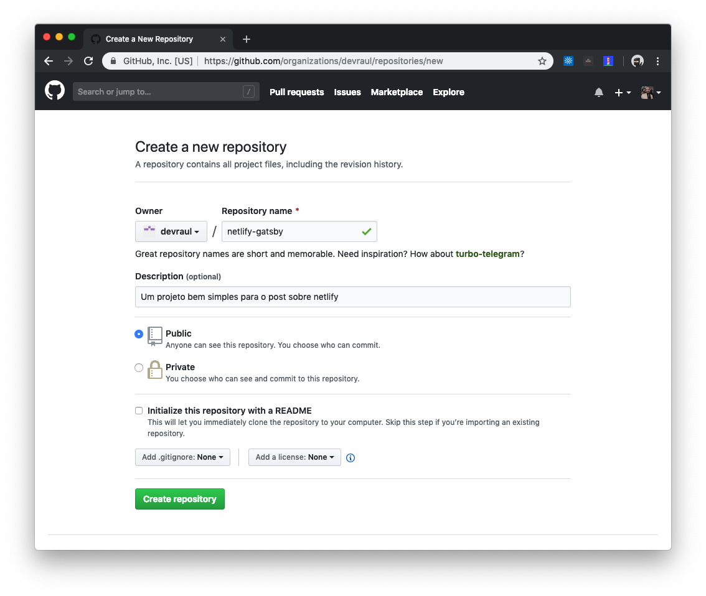

### Iniciando os arquivos

Bom, aqui talvez vá a parte mais avançada do tutorial, mas como eu disse eu disse anteriormente, não precisa ser com Gatsby, pode ser aquele seu projeto com Gulp ou Grunt que você tem que rodar uma tarefa de build para gerar o site final, sabe?

Seguindo o [tutorial mais básico do Gatsby](https://www.gatsbyjs.org/docs/quick-start/), com a ferramenta de linha de comando deles, vou iniciar um projeto novo:

```bash
gatsby new netlify-gatsiby
```

Navegando para dentro da pasta, teremos esses arquivos:


Ao criar um novo repositório, o Github te da o passo-a-passo para mandar seus arquivos. Vamos seguir então as instruções (segunda sessão):


Nosso projeto ainda não está sendo controlado pelo Git. Então, antes de executar os passos acima, vamos primeiro configurar o git:

```bash
git init
```

Depois, vamos informa-lo qual o endereço do nosso repositório remoto:

```bash
git remote add origin git@github.com:devraul/netlify-gatsby.git
```

E em seguida, adicionaremos e comitaremos os arquivos do projeto:

```bash
git add .
git commit -m "Initial files"
```

Agora, basta enviar nossos arquivos para a branch master remota:

```bash
git push -u origin master
```

E o resultado será:

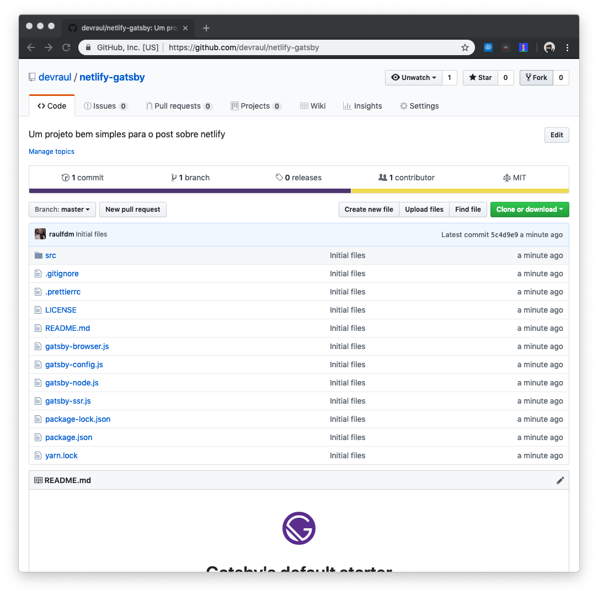

### Gerando o projeto

Bom, já temos o nosso projeto pré configurado. Vamos fazer um teste para ver o build funcionando:

```bash
# Dentro da pasta raíz do projeto
yarn build
```

No caso do Gatsby, ele vai gerar todos os arquivos que temos que mandar para o servidor em uma pasta chamada `public`:

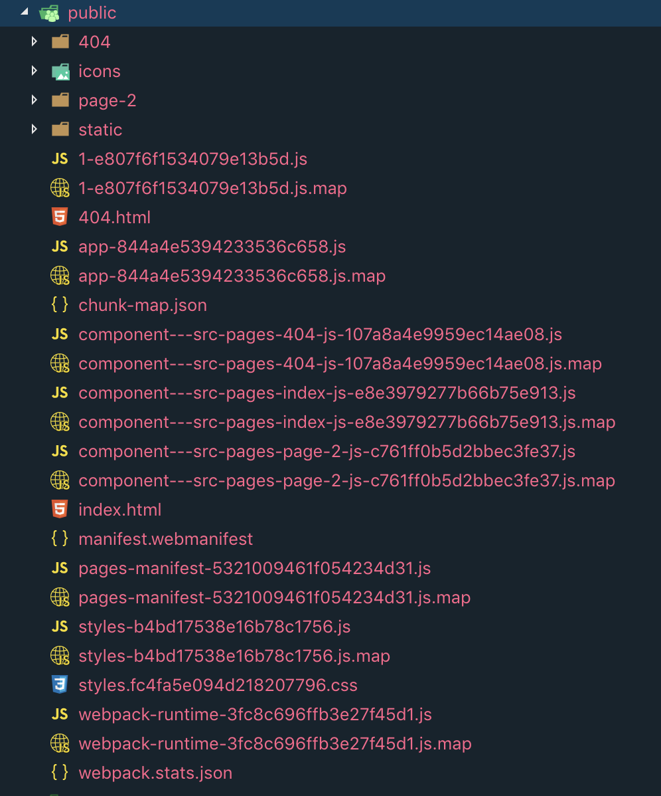

Não se preocupe com a quantidade de arquivos e nem em entender o que é cada um. O que a gente tem que saber é que se a gente mandar TUDO ISSO para um servidor HTTP, ele deverá renderizar uma página bonitona pra gente.

Bom… vamos testar isso antes então?

Com um pacote **npm** sensacional chamado [live-server](https://www.npmjs.com/package/live-server) instalado global, vou navegar até a pasta `public` e iniciar um servidor HTTP:

```bash
cd public
live-server
```

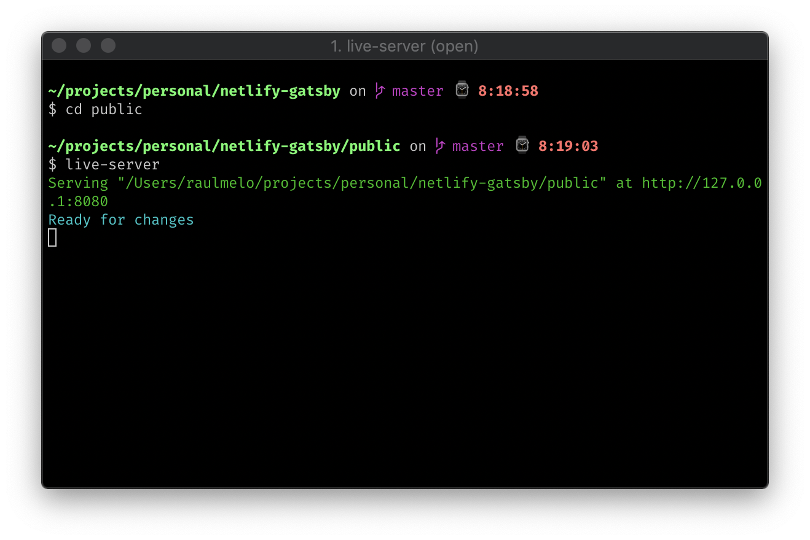

E o resultado…

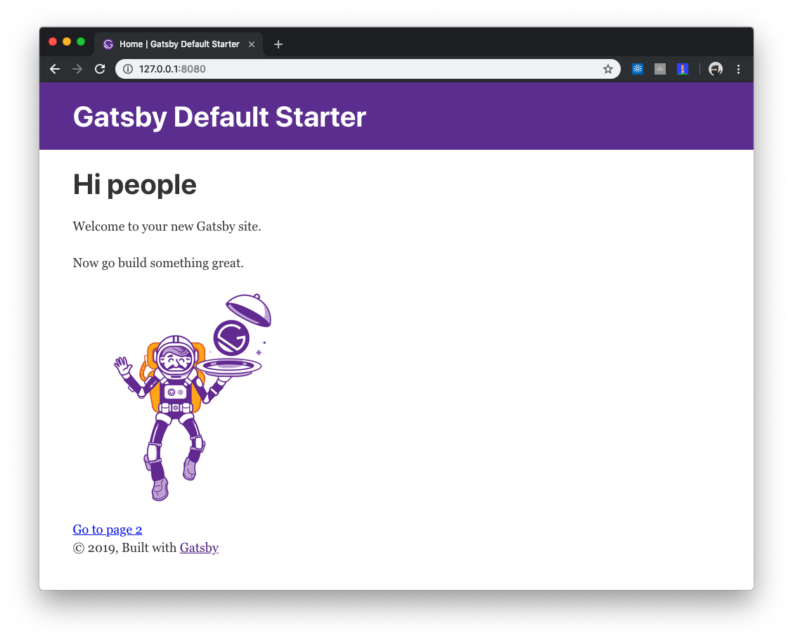

Bom, é isso que queremos mostrar, mas online.

Vamos para o Netlify.

---

### Configurando nosso projeto na plataforma

Aqui talvez seja a parte mais fácil de todas.

O primeiro passo que você deve fazer é criar uma conta. Eu usei minha conta do Github para isso.

Em seguida, ao acessar a sua _home_, clique em em `New site From Git`:


Em seguida, selecione a plataforma que o seu repositório se encontra. Neste caso, Github:


Agora, é só procurar pelo repositório `netlify-gatsby` e o selecionar:

![Criando um novo projeto no Netlify [2]](./assets/netlify-create-new-repo2.png)

Como Gatsby é uma ferramenta bem conhecida pela plataforma, ele já reconhece e nos dá algumas opções pré configuradas:


Mas vamos entender cada opção para caso seu projeto seja diferente, você possa configurar de outra maneira:

- **Branch to Deploy**. Essa é a opção que vai dizer ao Netlify qual branch ele deve escutar. Nesse caso é a `master` . Isso significa que cada commit que for feito na `master`, o Netlify rodará o processo de Build e deploy da sua aplicação.

- **Build command**. Lembra que a gente teve que rodar o comando `yarn build` para gerar nossos arquivos finais? Se a gente abrir o package json deste projeto, o comando `build` está mapeado justamente para `gatsby build`:

```json:title=package.json
{
  //...
  "scripts": {
    "build": "gatsby build",
    "develop": "gatsby develop",
    "format": "prettier --write src/**/*.{js,jsx}",
    "start": "npm run develop",
    "serve": "gatsby serve",
    "test": "echo \"Write test! -> https://gatsby.dev/unit-testing\""
  }
  //...
}
```

- **Public directory**. Aqui é qual a pasta que os arquivos estarão disponíveis. No caso do nosso projeto é a `public`, mas poderia ser qualquer outra como `dist` ou `build`.

- **Advanced Options**. Ainda é possível fazer uma série de configurações mais avançadas. Imagina que você precisa de um token de acesso que não pode ficar salvo na aplicação e vai ser injetado como variável de ambiente? É aqui que você define isso. No nosso exemplo, não precisaremos, mas sugiro dar uma olhada.

Processo configurado, bora pro próximo passo clicando no botão `Deploy Site`.

Imediatamente nosso site será construído e hospedado pela plataforma:

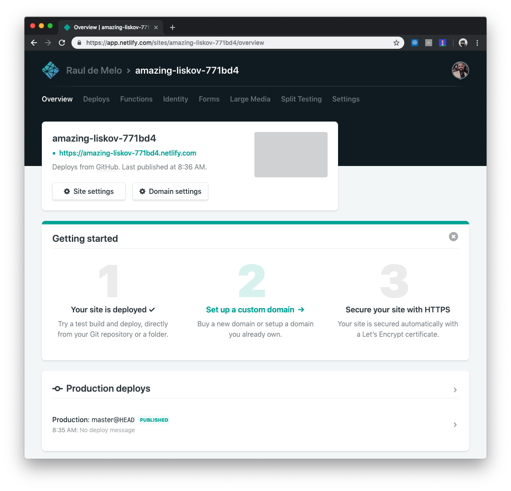

Perceba que o nosso projeto inicialmente foi gerado como: **amazing-liskov-771bd4**.

Não é bem isso que a gente quer, mas vamos ver se está funcionando clicando no link:

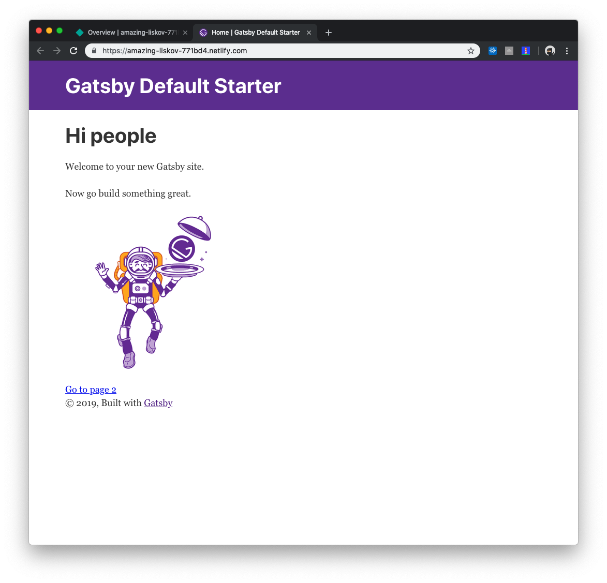

Deu certo!!!! Ta online.

Agora vamos mudar aquele nome estranho para algo que seja mais legível e fácil de lembrar.

Clique no botão `Site Settings` e em seguida `Change site Name`:

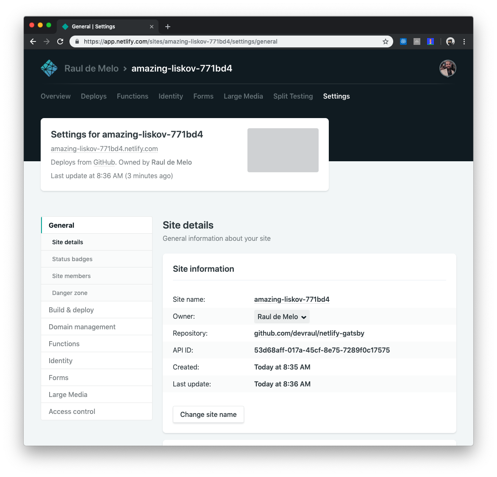


Agora é só salvar e já pode acessar a nova URL:


Por padrão, sempre será o nome que você escolheu `.netlify.app`.

Caso você tenha um domínio próprio, ainda no `Site Settings`, existe uma sessão específica para isso.

## Mas e aí? É automático mesmo?

Lembra que eu comentei sobre o ponto positivo ser o fato da plataforma colocar um hook (gancho) em um branch do teu repositório e fazer o deploy automático assim que um novo commit surgir? Será mesmo? Vamos testar.

A título de praticidade, vou fazer alterações diretamente na master, mas lembre-se que isso não é uma boa prática quando estamos versionando um projeto.

Então aqui vai uma lista das coisas que eu quero mudar:

- Mudar a cor de fundo do Header;
- Remover a "page 2";
- Trocar a imagem do Gatsby por um Gif;

Feita todas as mudanças, quando eu vejo o nosso `git log`, a nossa master local está com as novas mudanças:

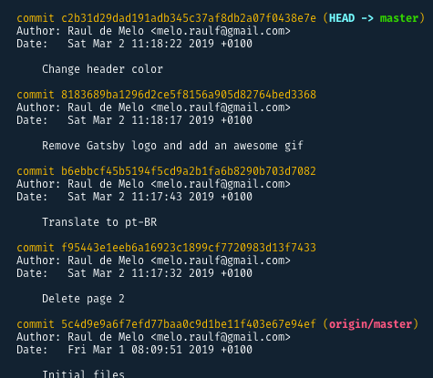

Enviando as nossas alterações para a `master` remota e acessando o projeto na Netlify, vemos que um novo building está sendo gerado:


Quando terminar, o commit que está como `building`, será alterado para `published` e podemos ver nossas alterações online:

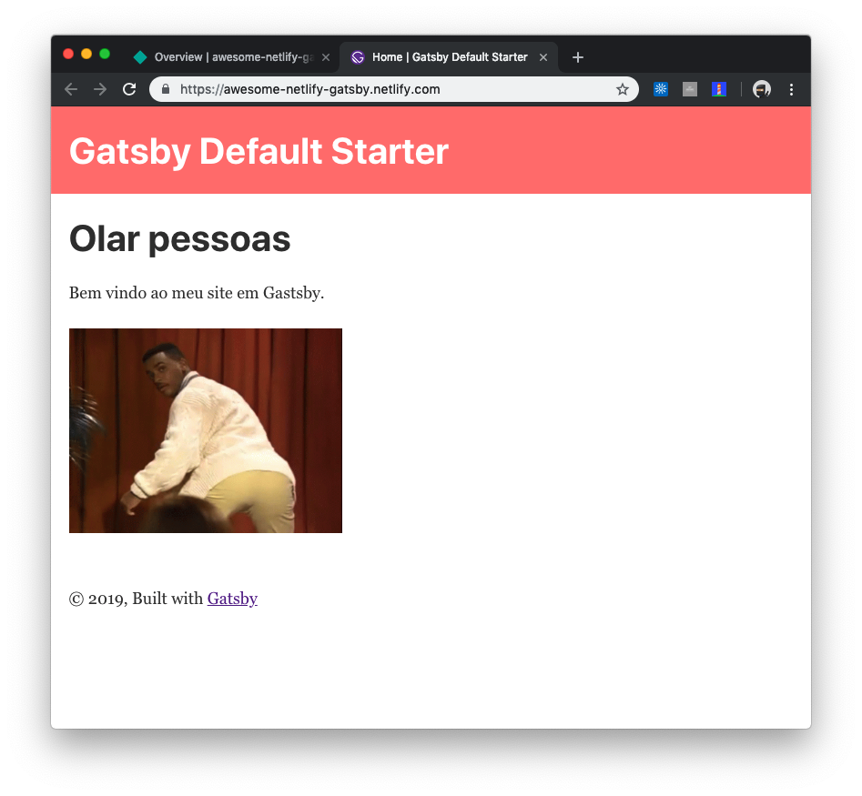

Fácil, não? Você nem precisa se preocupar com nada. Se o processo de `build` estiver bem definido, é só enviar as suas alterações e tudo acontece magicamente.

## Deploy Preview

Outra funcionalidade que eu sou apaixonado nessa belezura é uma chamada **deploy preview**, que nada mais é que a possibilidade de fazer fazer um deploy em um site diferente do original para você ver as suas mudanças em tempo real e sem alterar a aplicação original.

Em outras palavras, vamos imaginar que você vai implementar uma feature nova na sua aplicação. Você quer ver se ela estando online, tudo saiu conforme o esperado. Essa funcionalidade vai te dar essa possibilidade.

Bom… chega de imaginar, vamos ver isso na prática.

Pra te mostrar isso eu vou usar uma coisa que eu faço todos os dias no trabalho e até mesmo nos meus projetos pessoais/solo: Pull Request / Merge Request.

Se você não sabe o que é isso, basicamente é quando você cria um novo _branch_, implementa a o que você precisa e manda uma "requisição de mudanças" para a plataforma, que no caso é o Github.

Se você ainda não trabalha como dev em uma empresa, te prepara, que é isso que acontece todos os dias (assim eu espero).

Pra essa etapa, vou fazer as seguintes mudanças:

- Alterar o Titulo do header;
- Centralizar o conteúdo (titulo, texto e imagem);
- Adicionar o link do repositório e do artigo no rodapé da página;

### Iniciando as alterações

Eu gosto de começar criando uma issue no Github com as alterações/problemas que eu to tentando resolver:

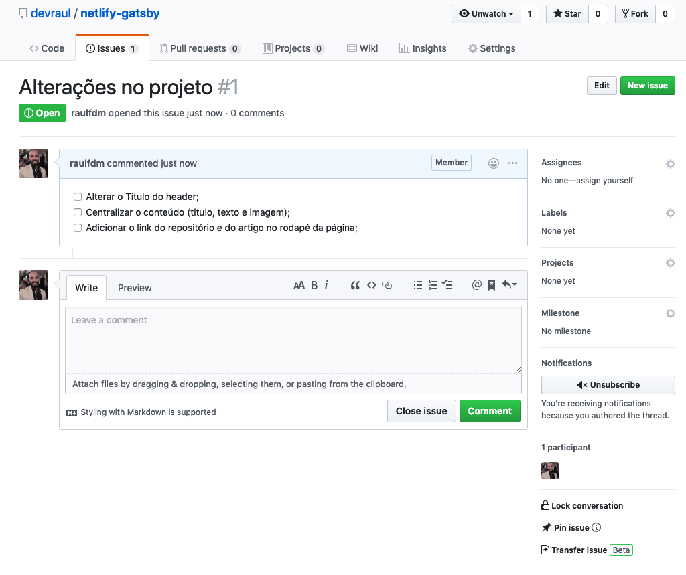

Beleza, baseado nisso, vou criar uma `branch` chamada `issue#1-project-changes` baseada na master:

```bash
# Pra ter certeza de ter a versão mais atualizada da master
git pull origin master
# Criar um novo branch e começar a usa-lo
git checkout -b issue#1-project-changes
# Enviar o novo branch para nosso repositório
git push origin issue#1-project-changes
```

---

Após realizar as alterações, podemos ver que no Github nossa _branch_ `issue#1` está igual a master, mas local ela possui todas as novas mudanças.

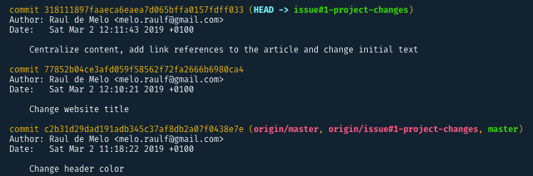

Vamos enviar nossas alterações:

```bash
# Enviando as mudanças
git push origin issue#1-project-changes
```

Perceba que ao fazer isso e acessar a sessão `Pull Requests`, o Github já identifica que há uma _branch_ atualizada e sugere para você criar um novo `Pull Request`.


Clicando no botão `Compare & pull request`, conseguimos já pular a parte de configuração. Basta agora adicionar uma descrição e criar:


Perceba que ao clicar e criar nossa Pull Request, uma tarefa do Netlify aparecerá e é aqui que a gente consegue ver a funcionalidade de `Deploy Preview`:

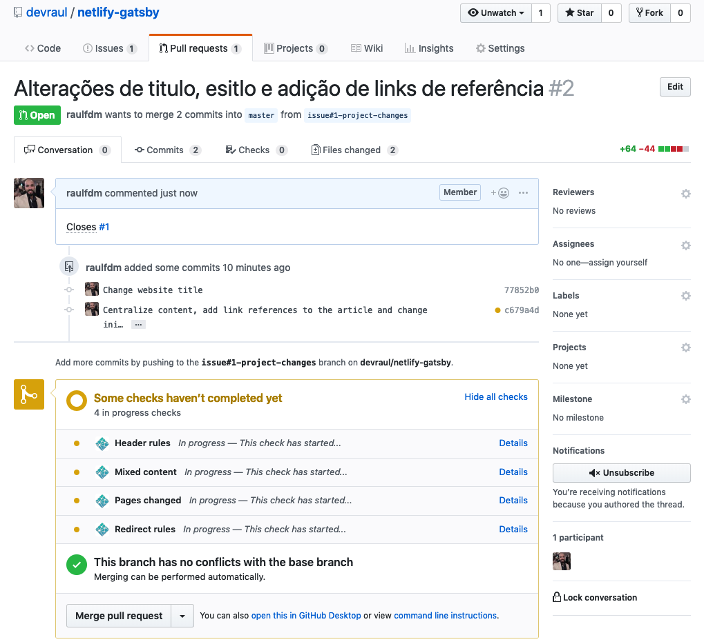

Ao finalizar todas as tarefas, saberemos se o `build` do nosso projeto está funcionando ou não e a opção tão desejada aparecerá:


Agora basta clicar em `details` para ver uma prévia das nossas alterações:


Perceba que a URL dessa prévia é diferente da do nosso site em si, ou seja, é outro site, mas com as mais novas alterações. Tanto isso é verdade que se a gente acessar o nosso site, ele ainda não terá essas novas mudanças:

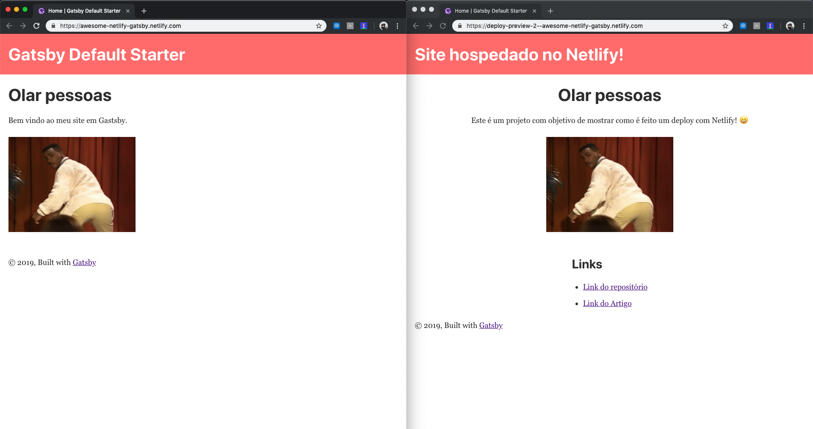

Bom, tudo certo, é isso mesmo que queremos, hora de aprovar o `Pull Request` e ter as alterações na versão oficial do site.

Para isso, na página da nossa `Pull Request` basta clicar no botão `Merge pull request` e em seguida `Confirm Merge`:


> Dica.
> Para evitar branches desnecessárias no teu repositório, clique em `Delete branch`.

Como o Netlify já tinha feito um deploy com aquelas alterações, o `deploy` para a versão oficial é ainda mais rápida.

E conferindo o nosso site, vemos que está atualizado e tudo como desejamos:

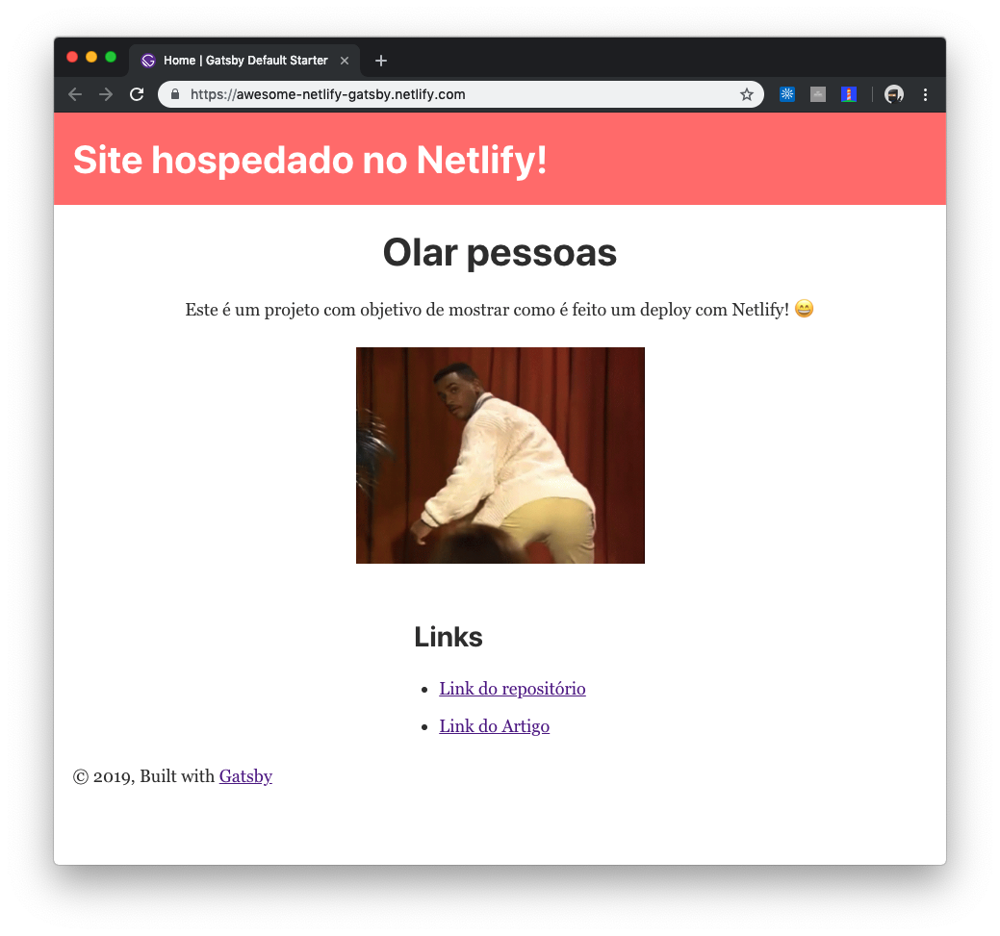

## Rollback

Caso você não saiba, o processo de rollback nada mais é do que "desfazer algo". Falando sobre deploy e projetos, nada mais é do que voltar a uma versão anterior.

Vamos imaginar que queremos alterar o GIF da nossa página e fazer o commit direto na master.

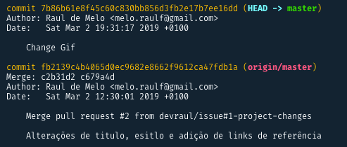

Enviando o nosso commit para a master remota, o Netlify vai automaticamente gerar nosso build e deploy e o resultado….


Puts… colocamos o link errado.

Antes de verificar o que foi de errado, vamos correr no Netlify e voltar o deploy para a versão anterior.

Na pagina inicial do projeto, temos uma sessão chamada `Production Deploys`:

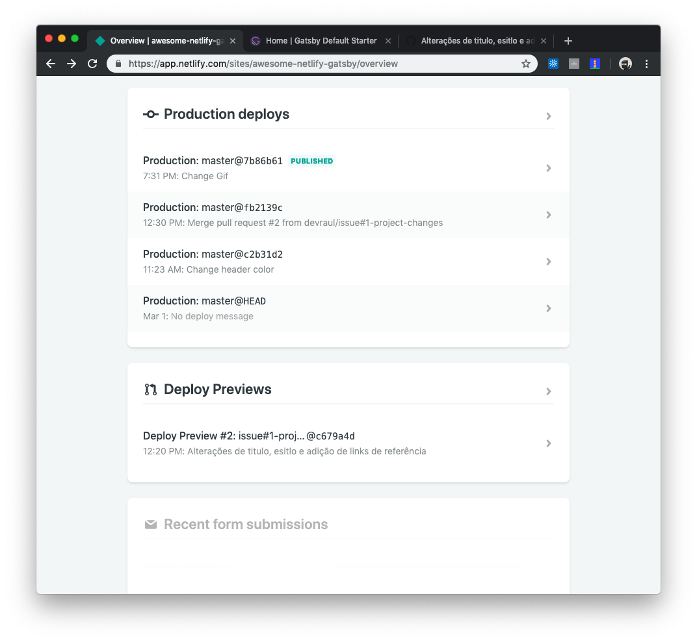

Se clicarmos neste título, vamos para uma página que nos mostrará todas as versões que já foram pra produção.


Perceba que o primeiro da lista com a tag `published` contém exatamente a nossa mensagem do commit, ou seja, precisamos voltar para o anterior.

Para fazer isso, basta clicar na linha correspondente ao deploy anterior. Você será redirecionado para outra página, com mais informações sobre ele:


Ao clicar no botão `Publish Deploy`, nos substituiremos o deploy quebrado (mais recente), com o último válido:

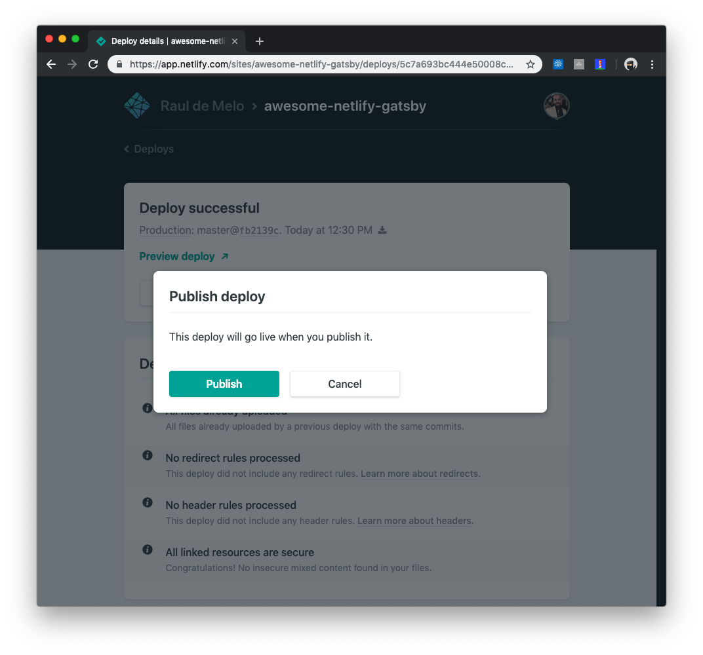

Ao abrirmos nosso web sítio, veremos que a substituição foi bem sucedida:


Agora é só irmos no código, rodar o projeto localmente e ver com calma qual foi o nosso erro.

---

## Conclusão

Antes de terminar, queria deixar aqui pra você um curso grátis de como utilizar Netlify do [Willian Justen](https://willianjusten.com.br/):

<YouTubeVideo src="https://www.youtube.com/embed/a1cIjP1bueM?list=PLlAbYrWSYTiMGMxQf9JSoZUU1rgVpGPth" />

São aulas bem curtinhas abordando quase tudo que abordei aqui de maneira bem simples e direta. Recomendo!

---

Bom, é isso.

Eu espero que você tenha conseguido entender como você pode subir seu projetinho de uma maneira bem simples e sem ter que pensar muito.

Como mencionei anteriormente, a plataforma Netlify ainda tem MUITA opção e funcionalidade que pode ser útil pra sua demanda. Novamente recomendo a dar uma olhada com calma na documentação.

E lembrando que, apesar deu ter usado Gatsby para gerar meu site, poderia ser QUALQUER outra ferramenta que converta/gere no final HTML + CSS + JS puro ou esses 3 sem nenhuma ferramenta.

Na própria documentação deles sobre [Deploy Continuo](https://docs.netlify.com/configure-builds/get-started/) eles dizem:

> It works for plain static sites, but it’s even more powerful when you’re using a [static site generator](https://www.staticgen.com/) or a frontend build tool like [Grunt](https://gruntjs.com/), [Gulp](https://gulpjs.com/), or [Broccoli](https://broccoli.build/).

Ou em ptBR:

> Funciona para sites estáticos, mas é ainda mais poderoso quando usado com algum [gerador de site estático](https://www.staticgen.com/) ou uma ferramenta frontend de build como [Grunt](https://gruntjs.com/), [Gulp](https://gulpjs.com/), ou [Broccoli](https://broccoli.build/).

---

Qualquer dúvida, feedback ou sugestão, manda aqui nos comentários que eu leio e respondo!

Um grande abraço.

- [Link do repositório](https://github.com/devraul/netlify-gatsby)
- [Site do artigo](https://awesome-netlify-gatsby.netlify.app/)
