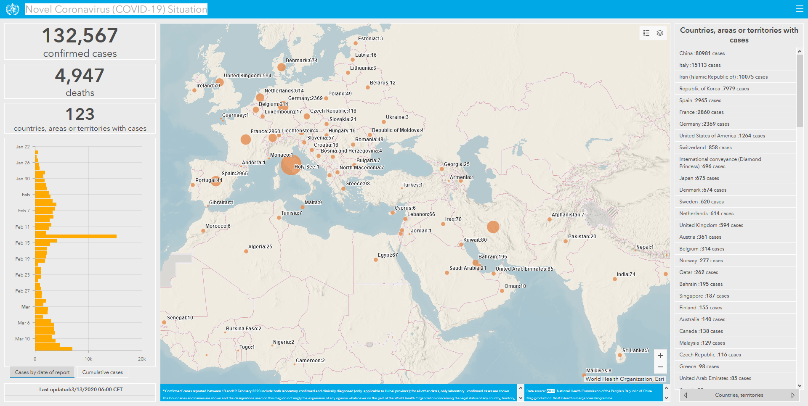

Desde que saí do Brasil (há 3 anos), continuo acompanhando as notícias e o que acontece por aí, muito pelo simples fato de os meus (amigos e familiares) continuam vivendo nele.

É um tipo de cordão umbilical que ainda não conseguir romper. Apesar de que, por questões de sanidade mental, reduzi drasticamente o meu envolvimento com o cenário brasileiro pra conseguir ter ânimo e energia para fazer o que eu preciso fazer por aqui (estudar, produzir minhas coisas, trabalhar bem, etc).

Uma coisa que ando percebendo é que pelo fato do "continente" Brasil (olha o tamanho desse país) ainda não ter tido muitos casos de corona e estar passando por uma crise econômica e política ferrenha, a população brasileira no geral ainda não está consciente do tamanho do problema que é o coronavírus e como ele pode (e vai) impactar no dia-a-dia das pessoas.

Então, este post visa trazer algumas informações bem básicas sobre o vírus e porque este é um problema gigante pro mundo todo.

---

## E a Holanda, como está?

A Holanda é um país deveras turístico. Todos os dias, são milhares e milhares de pessoas indo e vindo de todo o canto do mundo.

Para além das pessoas que chegam aqui de avião, ainda temos trem que vai direto pra Bélgica, França, Alemanha, ou seja, estamos no olho do furacão, sem dúvida.

Na data que escrevo este post (13 de Março 2020), a Holanda está com oficialmente **614** casos.

Ontem (12), o primeiro ministro Mark Rutte e o ministro da saúde Bruno Bruins, baseados nas recomendações dadas pelo Instituto Nacional de Saúde Pública da Holanda (RIVM), decretaram as seguintes medidas:

- Todo mundo na Holanda: em caso de resfriado, tosse, febre ou dor de garganta, devem ficar em casa evitar o contato social. Não ligar para o médico até você sentir uma piora;
- Encontros com mais de 100 pessoas serão cancelados no país inteiro. Isso também se aplica a lugares públicos como _musea_, concertos, teatros, clubes de esporte e competições esportivas;
- As pessoas devem trabalhar de casa o quanto puderem ou redistribuir as horas de trabalho. Pessoas vulneráveis (idosos e pessoas com baixa resistência) devem evitar aglomeração e transporte público. No geral, as pessoas devem limitar visitas à pessoas vulneráveis;
- Faculdades e universidades devem oferecer aulas online ao invés de aulas presenciais;
- Escolas de educação infantil (primário), fundamental, médio e creches continuarão abertas: se o número de infecções reportadas for menor do que os números internacionais. Além disso, crianças e adolescentes não devem se encontrar com pessoas do grupo de risco. Crianças com resfriado devem permanecer em casa.

> **Essas medidas devem ser aplicadas e mantidas até dia 31 de Março.**
>
> Fonte: https://www.rijksoverheid.nl/onderwerpen/coronavirus-covid-19/nieuws/2020/03/12/nieuwe-maatregelen-tegen-verspreiding-coronavirus-in-nederland

Ou seja, a medida agora é criar um isolamento social para evitar que mais pessoas fiquem doentes.

Na área de TI, temos o privilégio de conseguir exercer nossas atividades remotamente com quase zero de impacto na rotina do trabalho.

Sabendo disso, o CEO da empresa que trabalho mandou um email ontem convidando todos a trabalhar de casa até o fim do mês e disse que todas as reuniões deverão ser feitas online.

Ontem mesmo ao voltar pra casa, eu já notava bem menos movimentação nas estações e na rua!

Enfim, que comece a quarentena!

---

## Coronavírus

### É novo?

O coronavírus não é novo. O que é novo é essa "versão" dele que ta circulando por aí.

Na China, já meio que sabiam sobre essa nova mutação, mas até então, não era um problema sério. Então foi meio que tipo _"a gente tem outras coisas mais sérias pra estudar... mas deixa meia dúzia de cientista fazendo produzindo pesquisa sobre isso"._

### É letal?

O que se sabe até agora é que sua taxa mortalidade é de 3.5%, ou seja, de cada 100 pessoas, 3.5 morrem (meia pessoa morrer é complicado hein? 😛).

Muita gente usa esse número pra falar que nem é tudo isso, afinal, a gripe está aí matando 0.1% das pessoas que pegam todos os anos.

Porém, amigos, o problema não é esse e você verá logo a seguir.

### Quais os sintômas?

Nos casos simples, parecidos com o da gripe:

- febre;
- dores de cabeça;
- dores no corpo;
- indisposição

Nos casos graves:

- dificuldade para respirar;
- pneumonia;

### Se não é letal, qual o problema então?

Segundo as estatísticas, 80% das pessoas que contraem o vírus **não terão** os sintomas mais graves. Os outros 20% terão o começo dos sintomas mais sérios. 5% PRECISAM ser hospitalizados na UTI.

Ou seja, estamos falando que TALVEZ, de 100 pessoas, 20 irão no hospital necessariamente e 5 delas ficarão internadas na UTI. Consegue conceber o tamanho disso?

Se a gente jogar esse número para 100 mil pessoas infectadas, a gente tá falando que 20 mil pessoas irão no hospital e 5 mil serão internadas na UTI. Vocês acham que no Brasil (ou qualquer parte do mundo) existe estrutura para suportar todas essas pessoas?

A título de curiosidade, o Brasil tem 16 mil leitos de UTI para adultos sendo que 95% deles (15.200) estão ocupados.

> ["Em meio à pandemia de coronavírus, Brasil precisaria de 3.200 novos leitos de UTI no SUS" - O Globo](https://oglobo.globo.com/sociedade/em-meio-pandemia-de--brasil-precisaria-de-3200-novos-leitos-de-uti-no-sus-24299306)

A analogia que o [Atila Iamarino](https://twitter.com/oatila) usa, e que é a que eu mais gosto, é sobre o Metrô de SP.

O metrô recebe todo dia (durante o dia todo), mais ou menos 50 milhões de pessoas. Maravilha, a estrutura da conta.

Mas e se essas "50 milhões de pessoas" fossem pegar o metrô **NO MESMO HORÁRIO**. Será que ainda da conta? A resposta é bem óbvia, né?

Na China eles construíram hospitais provisórios com 1000 leitos em 10 dias, tiveram que transferir vários pacientes que já estavam no hospital para outra unidade, fazendo assim uma separação de quem está com vírus e pacientes normais, criar isolamento de casos e ainda assim foi caótico (agora parece que está mais controlado).

A China é um mundo dentro do planeta terra. A população de lá de é de **1.3 bilhões** de pessoas. Agora minha pergunta sincera é: Você acha que os outros países tem estrutura pra ter as mesmas medidas que a China teve?

A situação na Italia ficou caótica justamente porque o sistema de saúde foi sobrecarregado a ponto de precisar ser feito priorização de pacientes, ou seja, quem tem menos chance de recuperação é substituído por quem tem mais chances.

Quase todos os eventos que acontecem todos os anos estão sendo cancelados para evitar a disseminação por que as pessoas já entenderam que, apesar de não letal, o contágio pode ser caótico.

Agora eu vou te propor outra reflexão, se 20 mil pessoas precisarem de atendimento de um dia pra noite, o que acontece com quem já está no hospital? E aquelas pessoas que já estão doentes e precisam ir fazer algum tratamento (leucemia por exemplo)?

Deu pra entender a seriedade do problema? No dia 12 de Março de 2020 a OMS declarou pandemia.

### Como se transmite?

O Corona tem o mesmo comportamento da gripe comum quando o assunto é transmissão.

Uma pessoa infectada com o corona pode passar pra outras duas ou três pessoas. Ou seja, se ele dobra a cada ciclo de transmissão, em um cenário onde temos 100 pessoas infectadas e o isolamento não está acontecendo, os casos vão escalando pra, 200, 400, 800, 1600, 3200, 6400...e assim por diante.

Também como a gripe comum, ele se espalha mais fácil em baixas temperaturas pelo fato de conseguir ficar nas superfícies ou no ar por mais tempo do que no verão. O que pode explicar porque o hemisfério sul ainda tem poucos casos.

Como já diria o nosso amigo Ned Stark:

### Qual é o grupo de risco?

Até onde se sabe, crianças e adolescentes apresentam baixíssimas chances de desenvolverem os sintomas mais graves.

As condições mais perigosas são

- Pessoas com diabetes;
- Pessoas com hipertensão e problemas cardíacos;
- Pessoas com mais de 60 anos;
- Pessoas com problemas respiratórios;

> Aqui vale uma ressalva que o grupo de risco é o grupo de pessoas com mais chances de desenvolver os sintomas mais sérios. Isso não exclui a pequena possibilidade de uma pessoa fora do grupo de risco também desenvolver.

### Pega de novo?

Ainda não há evidências de que isso seja possível. Os casos onde parecia haver essa possibilidade, foi porque a pessoa testada ainda tinha um resquício de vírus no pulmão e o teste estava calibrado para pegar um número muito sensível.

> [Link](https://www.youtube.com/watch?v=Y3CNSpboV48&t=1065s)

### Como me proteger?

Uma lista rápida de como se proteger.

1. Lavar as mãos, com água e sabão;
2. Evitar mão nos olhos/boca;
3. Máscara normal não serve pra nada. As que protegem mesmo, precisam serem colocadas corretamente, a ponto que fique difícil para respirar;
4. Álcool em gel (concentração acima de 60%) mata o vírus real (mas não vale beber :p)
   4.1 Álcool em gel não é absorvido pelo corpo, então não tem essa de pegar no bafômetro
5. Vinagre não resolve coisa alguma, a não ser que seja o de limpeza.
6. Evitar lugares muito tumultuados (shows e eventos);
7. Evitar ar condicionado com muitas pessoas (difícil em?)

Se quiser ainda mais informações, recomendo este vídeo que o Atila e o Iberê conversam sobre por várias questões, dúvidas comuns e principalmente as máscaras:

<YouTubeVideo src="https://www.youtube.com/embed/0SNw_uyurCo"></YouTubeVideo>

### Como me manter informado?

#### App

Pra combater desinformação e ainda manter a população informada, o ministério da saúde públicou um aplicativo chamado "Coronavirus - SUS", segundo eles:

> "O app visa conscientizar a população sobre o Corona Vírus COVID-19, trazendo informativos de diversos tópicos como os sintomas, como se prevenir, o que fazer em caso de suspeita e infecção, mapa indicando unidades de saúde próximas, etc." - [Governo do Brasil](https://www.gov.br/pt-br/apps/coronavirus-sus)

O link para download:

- [Android (Play Store)](https://play.google.com/store/apps/details?id=br.gov.datasus.guardioes)
- [iPhone (Apple Store)](https://apps.apple.com/br/app/coronav%C3%ADrus-sus/id1408008382)

#### Telegram

Para além disso, se você usa Telegram, o Atila criou um canal de divulgação lá onde ele fica a todo momento soltando notas de atualização da situação, vídeos explicando perguntas e desmentindo fake news.

> Caso você não saiba, no Telegram é possível você "se inscrever" em uma conversa com alguém, onde a pessoa que criou o canal, manda para todos os inscritos vídeos, fotos e textos sobre algum assunto.

Para se inscrever nesse grupo, acessa o link https://t.me/corona_atila, ou dentro do app, busque pelo termo **corona_atila** que é o primeiro canal.

#### Redes sociais e sites

- OPAS (Organização Pan-americana da saúde) 👈
  - [Site oficial (em PT)](http://www.paho.org/bra/)
- Ministério da saúde
  - [Coronavirus de A-Z](https://www.saude.gov.br/saude-de-a-z/coronavirus)
  - [Instagram](https://www.instagram.com/minsaude/)
- OMS (Em inglês)
  - [Site oficial (em inglês) com as noticiais mundiais](https://www.who.int/emergencies/diseases/novel-coronavirus-2019)
  - [YouTube](https://www.youtube.com/channel/UC07-dOwgza1IguKA86jqxNA)
- Atila
  - [Twitter](https://twitter.com/oatila)
  - [Instagram](https://www.instagram.com/oatila/)

#### Mapa de calor

Recomendo o Mapa de calor oficial da OSM que foca no mundo:

Link: http://bit.ly/38Qchi8

E tem esse do ministério da saúde que é focado no Brasil:

Link: http://bit.ly/2wQ8ioi

---

## Conclusão

Eu realmente espero ter ajudado vocês a entenderem quão grave essa situação é e ter trazido alguma informação.

Não espalhem videos de informações não confiáveis no WhatsApp. Verifiquem o que as fontes oficiais estão dizendo sobre isso.

Se cuidem!

---

## Fontes e Refêrencias

Todos essas informações foram retiradas dos links recomendados anteriormente.

- ["Clinical course and risk factors for mortality of adult inpatients with COVID-19 in Wuhan, China: a retrospective cohort study"](<https://www.thelancet.com/journals/lancet/article/PIIS0140-6736(20)30566-3/fulltext>)

### Notícias

- ["OMS declara pandemia do novo coronavírus Sars-Cov-2" - Folha de SP](https://www1.folha.uol.com.br/equilibrioesaude/2020/03/oms-declara-pandemia-do-novo-coronavirus.shtml)
- ["Itália fecha lojas e bares para conter novo coronavirus" - Glob.com](https://g1.globo.com/mundo/noticia/2020/03/11/italia-anuncia-mais-medidas-para-conter-novo-coronavirus.ghtml)
- ["China finaliza construção de hospital com mil leitos em dez dias" - Agencia Brasil](https://agenciabrasil.ebc.com.br/internacional/noticia/2020-02/china-finaliza-construcao-de-hospital-com-mil-leitos-em-dez-dias)
- ["Coronavírus: em imagens, a construção de hospital na China em 10 dias" - BBC](https://www.bbc.com/portuguese/internacional-51354870)
