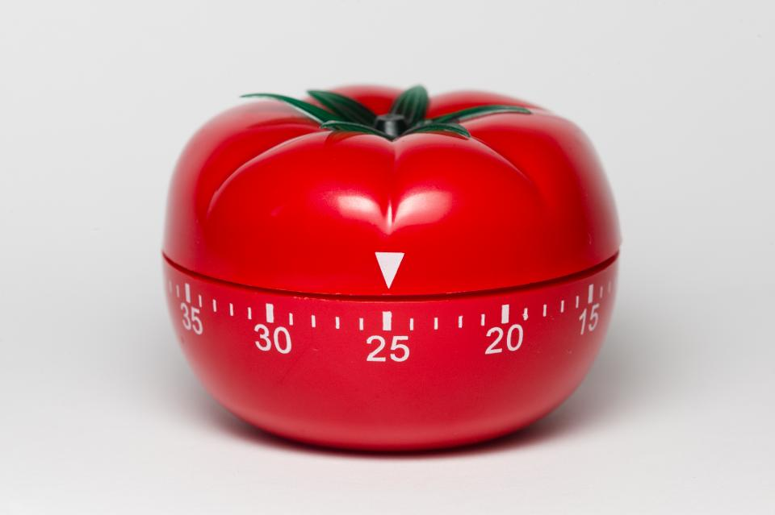
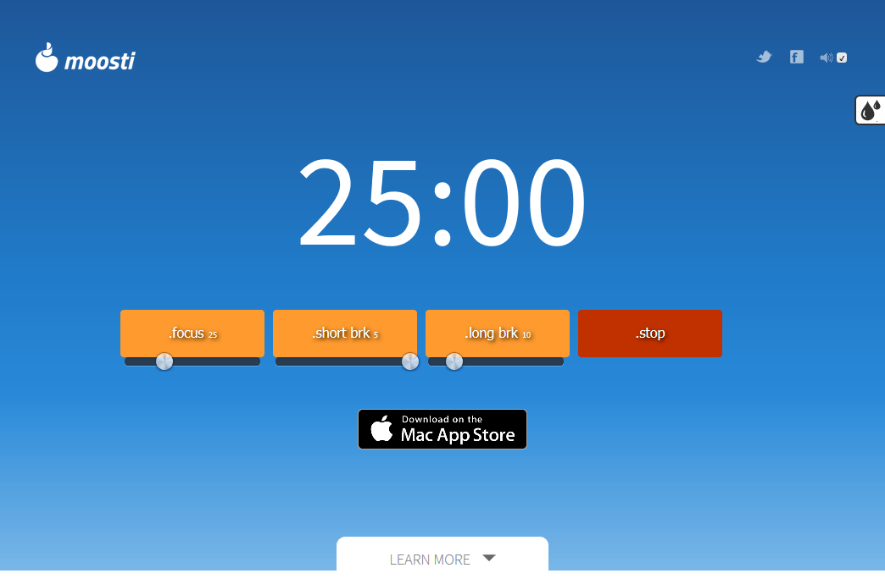
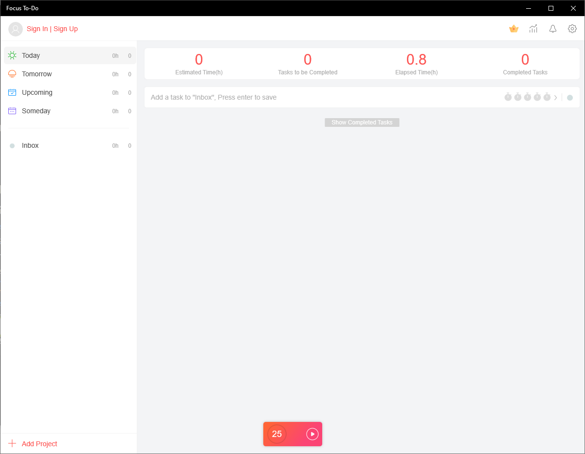
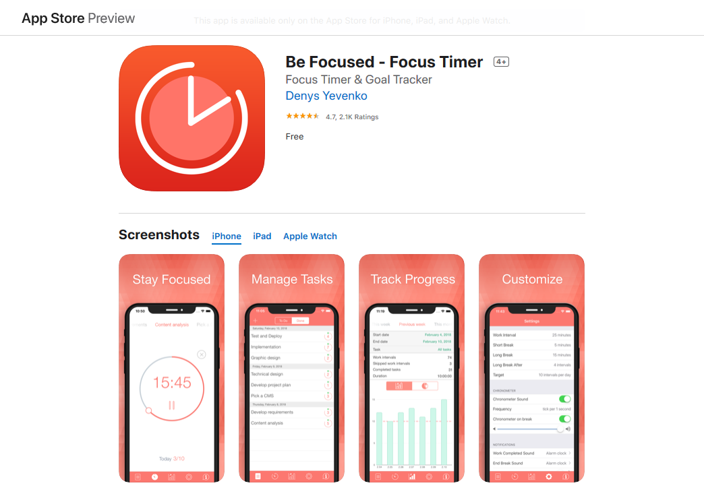

Fala pessoal, tudo em cima?

Hoje vim trazer pra vocês uma técnica que aprendi há alguns anos atrás e que mudou a forma com que eu trabalho, estudo e que me ajuda muito quando preciso resolver algo que demande mais concentração: **A Técnica Pomodoro**.

Esse método é um pouco mais complexo do que me propus a passar neste post, porém, minha ideia aqui é trazer o conceito como um todo e como aplicá-lo de uma forma simples.

---

## Flow, concentração e troca de contextos

Antes de entrar na técnica em si, é importante ter claro o que ela vem pra resolver.

### Estado de Flow

Você consegue se lembrar em algum momento que você estava tão componentrado enquanto fazia algo, que não viu o tempo passar, que não ouvia os sons externos, que não pensava em mais nada a não ser a ação daquele momento?

Com certeza já. Talvez hoje mesmo tenha tido um breve momento desse.

Na psicologia positiva, o estado de flow é justamente esse momento que foi e é vivido por todo ser humano em algum momento, onde ele se encontra 100% imerso em alguma atividade.

O pesquisador que culminou esse termo, Mihaly Csikszentmihalyi, descreve que o Flow possui 8 caracteristicas:

1. Completa concentração na tarefa;
1. Clareza no objetivo e recompensa ao realizar a tarefa;
1. Alteração da percepção de tempo (aumentando ou diminuindo);
1. O momento é extremamente gratificante;
1. Combinação de esforço mas também de facilidade;
1. Um balanço entre o desafio e sua habilidade;
1. Ação e consciencia se fundem e perda da auto-consciecia de ser;
1. Sensação de controle sobre a tarefa.

Não importa a grandeza da ação. Pode ser assistindo um filme, lendo um livro, ouvindo música, meditando, cozinho, correndo, enfim, qualquer coisa que você tenha tido tanto foco que as outras coisas eram irrelevantes e nem se quer existiam.

A grande questão é que atingir o flow é difícil e às vezes bastante demorado, podendo levar mais de 15 minutos. E isso é bem claro de notar, basta tentar lembrar em momentos de Flow e verá que não são tantos momentos assim no dia.

### Troca de contextos

Agora que você entende o que é o Flow e principalmente como é dificil de alcançá-lo, é preciso entender o que é troca de contexto.

Muitas pessoas acreditam que seres humanos são multitarefas. Também existe a crença que apenas mulheres conseguem fazer várias tarefas ao mesmo tempo, mas a verdade é que independente do sexo, o nosso cérebro não consegue lidar com várias tarefas ao mesmo tempo.

> Se quiser saber detalhes cientificos do porque isso é mito, sugiro ouvir este episódio do podcast Naruhodo: ["Os seres humanos podem ser multitarefas?"](https://www.b9.com.br/shows/naruhodo/naruhodo-133-os-seres-humanos-podem-ser-multitarefas/)

Troca de contexto nada mais é do que você alternar entre problemas.

Provavelmente você já passou por uma situação onde você estava tentando se concentrar em alguma tarefa do seu trabalho e seu gerente ou alguma outra pessoa parou do seu lado pra perguntar alguma coisa que exigia uma resposta mais elaborada. Nesse momento, você precisou interromper sua linha de raciocínio do problema anterior, pensar sobre o que pediram ou te perguntar e dar uma resposta.

Quando a pessoa foi embora, você provavelmente já não lembra mais nem o que estava fazendo.

Isso é troca de contextos.

E acredite, além de ser péssimo para providadde, é péssimo pra saúde mental, pois, trocar esse esses diferentes problemas exige muita energia do nosso cérebro.

É claro que o exemplo que dei foi bem específico, mas ela pode acontecer com você pelo simples fato de alguém te mandar uma mensagem no WhatsApp ou você receber um email que tira totalmente sua concentração do problema que estava sendo resolvido anteriormente.

E nesse exato ponto, que o pomodoro vem pra ajudar a gente.

---

## A origem

Essa técnica foi criada por Francesco Cirillo no final dos anos 80 com o objetivo de ajudá-lo medir seu tempo de estudo na faculdade versus a quantidade de coisa que precisava ser estudada.

O nome _"pomodoro"_ (tomate em Italiano) veio do formato do cronômetro utilizado por Francesco para medir esse tempo:

A técnica se tornou tão popular com o passar do tempo que ele publicou um livro sobre isso e até ministra cursos de como usá-la de forma mais efetiva, mensurando tempo, dividindo grupos de tarefa, etc.

Se tiver curiosidade ou quiser saber mais, basta checar o próprio [site do autor](https://francescocirillo.com/pages/pomodoro-technique) sobre isso.

---

## Método

A ideia do processo é bem simples.

Imagine que você tenha algo pra fazer que necessite de uma concentração extra. Com a tarefa a ser feita bem clara na sua mente, você coloca um cronômetro com **25 minutos** de duração (tempo de foco).

No fim desse período, você para tudo o que está fazendo e descanse por **5 minutos** (tempo de descanso curto), fechando **um ciclo**. A cada 4 ciclos, você fará uma pausa de **15 minutos** (tempo de descanso longo).

Simples, não?

Existem variações com relação ao tempo em cada etapa do processo, afinal, cada pessoa se concentra de uma forma, porém, a dinâmica do processo continuará exatamente a mesma.

Vamos agora detalhar um pouco melhor cada etapa.

### Etapa 1: Preparação (aquecimento)

Antes de começar a focar, existem alguns pontos que precisamos tirar do caminho, são eles:

#### 1. Planejar o que precisa ser feito

De nada adianta você dedicar tempo se as coisas não estão claras.

Pare alguns minutos antes para determinar o que deverá ser feito durante aquele período. Corrigir planilhas no excel, continuar escrevendo sua dissertação, ler um livro, tempo de tela, enfim, qualquer coisa desde que ela esteja clara na sua cabeça.

#### 2. Remover distrações virtuais

É extremamente importante que pouca e preferencialmente nenhuma distração nesse período.

Celular? Modo silencioso ou avião e de preferência longe para evitar aquela espiadinha. Mensageiros (Telegram, WhatsApp, Messenger) e redes sociais abertos no PC? Todos fechados!

O objetivo é concentrar em alguma tarefa específica e os itens mencionados acima são mestres nos tirar o foco.

Se desplugue.

#### 3. (tente) Prevenir distrações presenciais

Esse talvez seja o passo mais difícil de implementar, afinal, quem aqui nunca estava tentando se concentrar e de repente chega alguém falando ou perguntando alguma coisa?

No escritório que trabalho hoje, temos um acordo de não falar com a pessoa se ela estiver de fone de ouvido e posso falar que isso ajuda bastante.

Caso você tenha essa abertura, sugerir para seus colegas que você precisa daquele tempo para tarefa X, ou ir para uma sala ou um canto onde você consiga ficar mais isolado.

Em casa a mesma coisa. Deixe claro que você ficará indisponível por um período.

Eu sei, nem sempre é possível e ainda assim haverão casos de interrupção no seu fluxo de concentração. Por isso seja flexível e não desista de continuar, nem que você tenha que pausar por um momento o cronometro.

#### 4. Cole seus pensamentos no papel

Você já percebeu que quando temos algo a ser resolvido mas não está anotado em nenhum lugar, nossa mente fica trazendo a todo momento? Não importa o que você faça ou quanto pensa, sua mente sempre vai trazer o recado "precisamos resolver aquilo lá".

Isso é bom, pois você não esquece de vez do que precisa ser feito, mas quando falamos de concentração, isso é péssimo. Você está focado lendo um livro e do nada vem um pensamento aleatório "preciso comprar bacon pro final de semana" 😂.

Uma das formas de resolver isso é anotar o que precisa ser feito em um caderno, agenda ou em algum lugar que você se lembrará depois. Ao fazer isso, sua cabeça entende que agora você não vai mais esquecer daquilo e acaba liberando esse espaço.

Feito o aquecimento, agora é hora de entender o exercício.

### Tempo de concentração

Feito o aquecimento, é hora da execução.

Você se dedicará a sua tarefa durante 25 minutos seguidos, sem distrações ou pelo menos com o mínimo possível delas. Ao apito do relógio ou programa, você, mesmo com disposição para continuar, irá pausar tudo o que está fazendo para descansar.

Obviamente que se estiver no meio de um raciocínio e/ou faltando bem pouco pra terminar algo, vá até o fim, desde que isso não seja mais de que 1 ou 2 minutos. Caso contrário, se force a parar mesmo assim e terminar no próximo tempo.

Caso você sinta que toda vez você sente que poderia continuar no foco por mais tempo do que 25, regule seu tempo de foco para 30 ou 35 minutos de concentração mas não mais que isso.

Isso pode variar muito com a sua individualidade ou a complexidade da tarefa que está sendo realizada.

### Tempo de descanso curto

Esta é a pequena recompensa por ter completado 25 minutos de foco. É o momento que você vai poder sair do problema e respirar ar puro.

Hora de levantar da cadeira, fazer o sangue circular melhor, tomar um copo d'água, um café, ir no banheiro. Durante esses **5 minutos** de descanso, procure sair do ambiente que você está, nem que seja da cadeira pro sofá da sala.

Isso vai te ajudar a esquecer um pouco do que estava sendo feito e posso te garantir que em muitos dos casos, ajuda a pensar melhor sobre a atividade ou problema em si.

O tempo aqui também pode ser manipulado e vai de acordo com a sua necessidade. Entre 5 a 10 minutos mas não mais que isso.

### Tempo de descanso longo

Depois de repetir 4 vezes o processo de Foco-Descanso, é hora de relaxar.

Esse é o momento que você fará uma grande desconexão de tudo que estava fazendo nessas 2 (ou mais) horas.

Serão 15 minutos (até 30, dependendo de como estabeleceu o tempo de foco) para você ir comer, assistir alguma coisa, checar as redes sociais, enfim, para fazer o que quiser antes de começar o ciclo novamente.

### Resumindo

1. 25 minutos de foco
2. 5 minutos para respirar
3. repita 4 vezes os passos 1 e 2
4. 15 minutos de descanso
5. Volte para o passo 1 ou então, até a próxima 🙋‍♂️

Lembre-se de respeitar o tempo de descanso curto. Ele é ESSENCIAL para depois de 4, 6 horas de foco em um dia, você terminar suas atividades menos cansado(a) mentalmente.

Pense como se fosse um exercício físico. Temos o nosso tempo de atividade e o tempo para respirar, oxigenar o sangue e nos preparar para o próximo exercício.

## Ferramentas

Tudo que você vai precisar aqui é um relógio com a função de cronômetro. Pode ser um relógio de pulso, seu aplicativo nativo de relógio no celular, um cronômetro de cozinha.

Inclusive, se você fizer uma pesquisa no Google com a palavra `Timer`, ele vai te mostrar um cronômetro logo antes dos resultados:

Mas, caso queira um aplicativo que te ajude a não ter que mudar o tempo manualmente entre as diferentes etapas, existem algumas opções que eu utilizo na minha rotina.

Mas não fique atrelado a eles. Se você digitar no Google ou na loja de aplicativos do seu celular pelo termo `pomodoro`, você encontrará centenas de aplicativos, cada um com uma característica e um visual diferente do outro.

### Moosti

É bem simples e direto.

Um site com a configuração pronta pra sair fazendo, mas também permite uma customização mínima e máxima entre cada etapa. Caso queira receber uma notificação no fim de uma etapa, basta marcar a caixa no canto superior direito.

Bem útil caso você não queira instalar nada no computador.

- **Links**: [site](https://www.moosti.com/)
- **Plataformas**: Linux, MacOS, Windows
- **Preço**: Grátis

### Focus To-Do

Esse é um app para Windows que possui muitas funcionalidades, como criar projetos, fazer a contagem de quanto tempo você conseguiu se focar, separar por projetos.

Apesar disso, também pode ser usado da maneira mais simples possível, apenas dando play nos tempos sugeridos e ele faz a contagem pra você das etapas.

- **Links**: [Microsoft Store](https://www.microsoft.com/en-us/p/focus-to-do-pomodoro-timer-to-do-list-pomodoro-technique-task-organizer-time-tracker-schedule-planner-reminder/9n8gpb2tk8gb), [App Store](https://www.notion.so/raulmelo/Pomodoro-mais-foco-e-menos-cansa-o-09f8bab1ac2248eeb67120c9216ae3f3#ba85d433fec047aca190b5bd5a28d9ec)
- **Plataformas**: Windows, MacOS
- **Preço**: Grátis

### Be Focused - Focus Timer

Esse é o App que uso quando estou trabalhando no Mac.

Bem simples também e ainda possui um atalho para facilitar o início e/ou pausa de um tempo (cmd + shift + R).

- **Links**: [App Store](https://apps.apple.com/us/app/be-focused-focus-timer/id973130201)
- **Plataforma**: MacOS
- **Preço**: Grátis.

---

## Ponderações

Antes de fechar o post, eu quero trazer algumas reflexões e experiências próprias de anos de uso dessa técnica.

### Nem sempre vai dar certo

Infelizmente, tudo que demanda um pouco mais de esforço e organização, tem dias que não funcionam muito bem.

Às vezes o seu dia está cheio, as pessoas não param de te procurar, você precisa atender ligações durante o foco ou aconteça algo que você precise interromper o foco no meio.

Esses dias irão existir, mas não desanime.

Continue tentando aplicar nos momentos que achar que precisa de mais concentração.

### Descanso é parte do foco

Apesar de achar que estou sendo repetitivo, vou bater de novo nessa tecla: **respeite o tempo de descanso**.

Além de fazer parte do processo, ele é o responsável por conseguir chegar no fim do dia sem estar exausto(a) mentalmente.

Todas as vezes que o menosprezei, além de não conseguir progredir na minha tarefa, eu sempre senti que continuar focado ficava mais e mais difícil.

### Faça os ajustes necessários

Existem pessoas que demoram mais para se concentrar e precisam aproveitar melhor esse tempo. Se esse for o seu caso, ajuste o tempo para ao invés de 25 minutos de foco, 30, 40 minutos mas não se esqueça de regular o tempo de descanso na mesma medida.

### Talvez essa técnica não seja pra você

Apesar de ter meu ceticismo com relação a quem diz que não gosta de fazer, a individualidade precisa ser respeitada.

Se você tentou fazer e não conseguiu tirar proveito ou achou que não rendeu, mesmo fazendo ajustes, talvez a técnica não se encaixe muito bem no seu estilo.

## Conclusão

Espero ter ficado claro o método e como executa-lo.

Essa foi uma das ferramentas mais poderosas que fui apresentado nos últimos anos e tem me ajudado em muitas atividades da vida.

Lembro inclusive de uma vez que a utilizei para aliviar um pouco as horas e horas jogando God of War 3. No primeiro dia, joguei durante 6 horas seguidas e fui dormir exausto. Nos dias seguintes fui colocando um limite de 40~50 minutos e descansando por uns 10 e consegui ficar menos cansado.

Se não estiver convencido, tenta e depois me conta no Instagram ou twitter o que achou! 😉

## Referencias

- [https://en.wikipedia.org/wiki/Flow\_(psychology)](<https://en.wikipedia.org/wiki/Flow_(psychology)>)
- [https://positivepsychology.com/mihaly-csikszentmihalyi-father-of-flow/](https://positivepsychology.com/mihaly-csikszentmihalyi-father-of-flow/)
- [https://en.wikipedia.org/wiki/Flow\_(psychology)](<https://en.wikipedia.org/wiki/Flow_(psychology)>)
- [https://francescocirillo.com/pages/pomodoro-technique](https://francescocirillo.com/pages/pomodoro-technique)
- [https://en.wikipedia.org/wiki/Pomodoro_Technique](https://en.wikipedia.org/wiki/Pomodoro_Technique)
