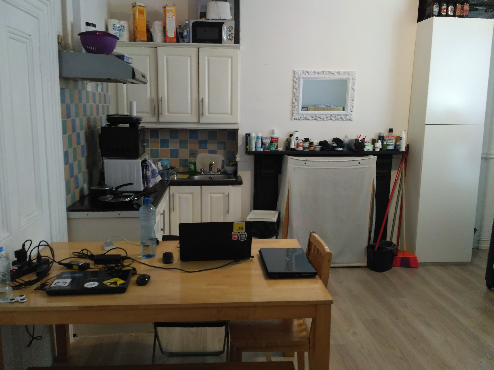
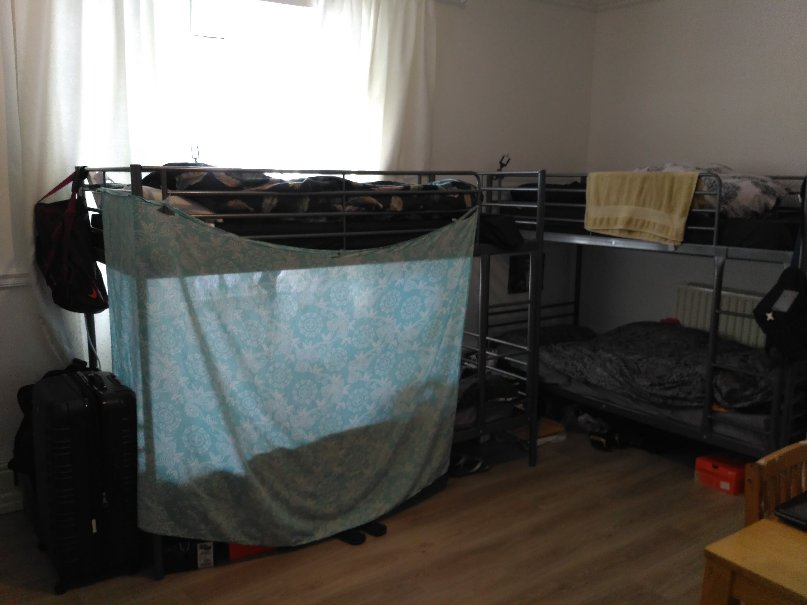

Fala pessoal, tudo em cima?

No post anterior contei um pouco sobre como foi minha chegada, impressões do curso e meu processo de estudos da língua inglesa.

Hoje, vou contar pra vocês como foi a saga de encontrar um lugar pra morar em um país que passa por uma crise imobiliária bem severa.

---

## Acomodação

Como comentei anteriormente, a agência que me levou para o intercâmbio também oferecia uma casa temporária para os alunos morarem até encontrarem um lar definitivo.

Como meu orçamento não estava tão bom e o aluguel desse tipo de casa geralmente tem um valor acima da média por conta dos serviços que são oferecidos, eu peguei apenas duas semanas de acomodação.

No dia seguinte a minha chegada na casa, ainda deitado na cama, o Raul que habita dentro de mim mandou o recado:

> "Você não vai se divertir, sair, aproveitar nada enquanto você não arrumar outro lugar pra ficar. Essa é a prioridade número um e você só vai pensar nisso."

E bem, foi assim que eu lidei com esse processo do começo ao fim, afinal, eu só tinha 14 dias para isso.

Tentei conversar com o pessoal da agência para ver qual a possibilidade de estender essas duas semanas caso eu não encontrasse outro lugar, e bem, me disseram:

> "Vish, isso é bem difícil. Temos estudantes chegando o tempo todo. Assim que alguém sai da casa, no dia seguinte entra outro que já pagou por isso."

Ao ouvir isso, pensei: "É... corre."

---

## Estratégias

Para resolver esse problema, eu defini algumas estratégias que no fim se mostraram essenciais no resultado sucesso da missão (sim, já era uma missão). Foram elas:

### Ter onde procurar

Ao contrário do Brasil (pelo menos no Estado de SP, onde eu nasci), onde entramos em contato com imobiliária dizendo o que estamos procurando e o agente oferece uma lista de opções para você ir visitar e ver se gosta ou não, na Irlanda, ainda por cima como estudante, as coisas funcionam um pouco diferentes.

Vamos imaginar que você tivesse uma imobiliária no Brasil. Então, uma pessoa que está lá fazendo intercâmbio por apenas 6 meses entra em contato dizendo querer alugar uma casa. Você sabe que ele pode ir embora a qualquer momento se nem devolver a chave. Você alugaria algo pra esse perfil de pessoa?

Eu nem sei com é a lei nessa situação, mas só pela situação no geral, já coloca o estudante em um baixíssimo nível de credibilidade.

Você também pode alugar direto com o dono, que tem um nome chique de "Land lord" (senhor da terra) ou "Land lady" (senhora da terra). Mas também, a situação é quase a mesma e encontrar pessoas pessoas boas, dispostas a não passar o estudante para trás (acredite, há muitas histórias não tão boas sobre casos de estudantes que alugam direto com o dono da casa) é bem difícil.

Assim, a opção que resta é ir atrás de pessoas que já moram em casas e conseguiram alugar, seja por uma sorte, seja porque elas têm contrato de trabalho ou visto permanente e tentar conseguir um quarto ou uma cama. E para isso, você precisa entrar nas comunidades locais.

Ainda quando estava no Brasil, comecei a entrar em grupos de brasileiros no Facebook, apenas nos maiores para encontrar essas pessoas. E realmente, sempre tinham pessoas anunciando quarto de solteiro, quarto compartilhado, quarto de casal, etc.

Mas eu decidi ir além nisso e entrar em TODOS os grupos existentes, tanto de brasileiro quanto de gringos. Além disso, ativei as notificações de cada um para ser em tempo real, ou seja, se alguém postar algo, independente do que, eu receberia um aviso de notificação.

Confesso que no começo foi bem chato, pois eu sempre detestei (e ainda detesto) receber notificações de redes sociais, principalmente de coisas aleatórias. Porém, no meio daquela bagunça de postagem de pessoas reclamando da vida, contando histórias tristes (às vezes umas felizes), aparecia anúncios de vagas em casas.

E não tinha outra maneira. As primeiras pessoas a mandarem mensagem em um post, serão as primeiras escolhidas.

### Rotina

Todos os dias, eu acordava, tomava meu café da manhã, ligava meu notebook, abria o Facebook e ficava algumas horas ali vendo as notificações da noite anterior, mandando mensagem em posts feitos durante a noite e coisas que eu havia perdido e também bem atento para novos posts.

Programava um pouco, assistia algum vídeo no YouTube, almoçava e voltava pro Facebook pra ver se algo aparecia.

### Foco

Eu levei bem ao pé da letra o recado que meu eu interno mandou. Sentia como se tivesse ligado o modo sobrevivência. Era só o que conseguia pensar.

Me chamaram pra ir em festa da agência, não foi. Me chamaram pra ir em um bar famoso de Dublin, não foi. Todo meu esforço estava concentrado em uma missão: "Arrumar um local pra ficar".

É óbvio que as pessoas que saíram para baladas e já estavam vivendo o intercâmbio desde o dia 0, no fim, também conseguiram casa. Não estou dizendo que existe apenas um modo de se conseguir o que quer, porém, quando estou em situações como essa, mesmo que eu fosse pro pub, eu não aproveitaria, pois, constantemente, meu inconsciente ia mandar um recado: "Você poderia estar em casa, pronto para responder aquela notificação".

Assim, deixei para fazer essas coisas quando já tivesse algo certo.

### Paciência

Depois de toda a estratégia "militar" montada, agora era questão de paciência e fazer o que precisava ser feito. Mesmo sabendo disso, confesso que foi bem difícil.

É complicado você ter um problema pra resolver, que não depende só de você, mas também, de pessoas anunciando e sorte de sua mensagem ser notada.

---

## Primeira visita

Depois de 3 dias, finalmente consegui receber uma resposta de um brasileiro que estava passando sua vaga em um apartamento perto do centro da cidade.

Trocamos mensagens e combinamos uma visita no dia seguinte.

Acordei logo cedo, bem antes do previsto. Me arrumei, tomei meu café, salvei o Google Maps offline da região, subi no ônibus e me parti para a visita.

Confesso que fiquei um pouco apreensivo indo visitar o apartamento de uma pessoa que nunca vi na vida, em um país tão distante do meu, com dinâmicas sociais completamente diferentes e em uma cidade desconhecida. Mas, aparentemente, eram assim que as coisas funcionavam por ali.

Chegando no local, mandei mensagem para o rapaz, que demorou uns 15 minutos pra me responder de volta. Cheguei a pensar que eu tinha feito papel de trouxa e que havia ido lá à toa, até que ele me respondeu com um:

> "Desculpa, estava mostrando o apartamento para outra pessoa."

Ao me receber, nos apresentamos e entramos no prédio, que diga-se de passagem, era bem esquisito.

Quanto mais a gente andava no corredor central, mais portas havia, como se cada uma delas dividisse aqueles apartamentos em pequenos blocos.

Eis que chegamos e no apartamento e... meu deus.

Eu tinha 100% de certeza que as pessoas ou estavam fumando algo, ou haviam fumado na noite anterior, porque foi como se tivesse aberto uma porta em uma sala cheia de fumaça.

<Gif
  src="https://media.giphy.com/media/3o6Mb5ZGLUIPgMozD2/giphy.gif"
  caption="Fumando dentro de casa"
></Gif>

Na sala, estavam 5 brasileiros onde, 1 se estava deitado (talvez dormindo), 3 no sofá do lado e 1 sentado na cadeira ao lado de uma mesa redonda bem velha.

No centro da sala, havia uma mesa cheia de tabaco, seda, maconha, um cinzeiro com bitucas de cigarro e latas de energético e cerveja. O típico cenário pós-festa.... ou seria assim normalmente? 🤔

Todos me cumprimentaram e o que era aparentemente o "líder" da casa, pediu para o rapaz terminar de me mostrar a casa e em seguida que retornássemos à sala.

Fomos para a cozinha, bem colada com a sala. Apesar de estar levemente organizada, era um verdadeiro caos. Todos os armários enferrujados, fogão de duas bocas, um microondas que parecia não funcionar.

Então seguimos para o quarto que eu ficaria e esse não tinha nada de mais. Eram três camas de solteiro, umas malas nos cantos do quarto e um guarda-roupa grande que era divido entre as três pessoas.

Seguimos para o único banheiro da casa. Havia um pouco de mofo nas paredes, mas tirando isso, parecia limpo e em ordem.

Então, retornarmos para a sala, onde o líder foi bem gentil e me ofereceu água e me pediu para sentar para que começássemos a entrevista.

Caso você não saiba, qualquer aluguel de casa/quarto/apartamento, independente se é com agente imobiliário, dono ou alguém da casa sub alugando um espaço, é preciso passar por entrevistas, onde a pessoa que está oferecendo o imóvel faz uma série de perguntas com várias pessoas e no fim, avaliam todos os candidatos e escolhem quem tem mais potencial de sucesso, seja financeiro, seja alguém que "combina" com a casa ou com a expectativa da pessoa. Como se fosse uma entrevista de emprego mesmo.

Por fim, o líder me fez uma série de perguntas como de onde eu era no Brasil, há quanto tempo estava na Irlanda, se estava gostando, primeiras impressões da cidade e o que eu tinha achado da casa.

Apesar deu ter detestado, eu realmente precisava de um local para ficar. Então, tentei esconder o que realmente tinha achado da casa e dar a entender de que gostaria de estar ali.

Ele então continuou. Me explicou quais eram as regras da casa e pra minha surpresa, haviam várias. Entre elas:

1. Toda semana, duas pessoas eram responsáveis pela limpeza da casa, como uma escala de trabalho. Limpar o banheiro, por o lixo para fora, arrumar a cozinha e quartos;
2. A sala era um ambiente comum para todos os moradores e, pelo fato da casa não ter varanda e sair do prédio era uma jornada, era permitido fumar ali, mas sempre com a porta que dava pro corredor e quartos fechada;
3. Pelo menos uma vez por semana eles davam uma festa no apartamento podendo ter convidados;
4. As comidas eram individuais. As únicas coisas compartilhadas eram produtos de limpeza, papel higiênico e coisas para a casa em si. Para esses, era feito uma vaquinha toda semana;
5. Quando combinado previamente, um morador poderia levar uma ficante pra transar na casa, e o único lugar permitido para o coito era a sala. Nesses dias, a cozinha deveria ser evitada ao máximo.

Sabe naqueles filmes onde o personagem está conversando com alguém e de repente a voz da outra pessoa começa a ficar distante, cada vez mais, e ele se perde nos próprios pensamentos? Foi tipo isso que aconteceu comigo.

Logo voltei do meu transe e ele me perguntou o que eu tinha achado de aquilo tudo que tinha dito.

Disse a ele que tinha gostado o fato de ter regras claras, afinal, quando não temos nenhuma, tudo é permitido, afinal, nada foi acordado ou proibido.

Também disse que já estava pensando como me adaptaria ali, utilizando a mesa da sala pra estudar e fazer minhas coisas, os momentos que ficaria no quarto, etc.

No fim, tanto eu quanto ele sabíamos que o Raul não tinha absolutamente nada a ver com aquele local, mesmo eu querendo fazer parecer que estava curtindo a experiência.

Ao se despedir, ele me disse que havia gostado de mim e que teria mais algumas visitas no mesmo dia, mas no máximo na manhã do dia seguinte pediria para o rapaz que anunciou a vaga mandar mensagem me falando se tinha rolado ou não.

Na volta pra casa, ainda no ônibus, encostei a cabeça no vidro tentando digerir o que diabos tinha acabado de acontecer e principalmente o que eu faria caso fosse escolhido para naquela casa.

> Como eu poderia estudar com a galera fumando e fazendo festa?

Eu saí da casa com a sensação de que me lembrava algum seriado. Quase chegando em casa, lembrei que aquele lugar parecia com a casa do Jesse Pinkman no Breaking Bad.

Na manhã seguinte, o rapaz havia me mandado mensagem falando que havia encontrado uma pessoa que se encaixa bem no perfil da casa.

Um alívio. De volta à busca.

---

## Sorte grande

> "Tic. Toc. 7 dias restantes..."

Esse é um pensamento bem difícil para uma pessoa com certo grau de ansiedade lidar, mas era algo me vinha na cabeça a cada momento que ousava esquecer.

Dois dias haviam se passado desde a visita na casa do Jesse Pinkman e até agora, nada de outra visita dar certo.

Sempre que mandava mensagem para alguém, ou era ignorado, ou recebia uma resposta falando que a vaga já havia sido preenchida.

> "Como preenchida? Você acabou de postar e eu fui o terceiro a mandar mensagem..."

Assim como em uma competição esportiva, na busca por moradias, quem fica com a medalha ou troféu é só o primeiro lugar.

> "Sua hora vai chegar... força"

E chegou.

Ainda naquele dia, recebi uma notificação no Facebook que de um post dizia:

> "3 vagas disponíveis..."

O resto da mensagem, pouco importava. Respondi a postagem na mesma hora e já mandei mensagem privada para a menina dizendo:

> "Eu quero as 3."

Foi uma decisão a princípio pouco intuitiva, mas meu raciocínio foi:

1. Se ela ofereceu 3 vagas, provavelmente quer se desfazer de todas o mais rápido possível;
2. Na residência estudantil, todos estavam estavam na mesma situação que eu, ou seja, conseguir mais duas pessoas seria o menor dos problemas.

Dois minutos depois ela me responde:

> "Oi, você quer mesmo as 3 vagas?"

Ainda com o chat aberto, para não perder um segundo sequer, respondi:

> "Sim, pra mim e mais duas pessoas que estão morando comigo."

No fim, eu ainda não sabia quem era essas duas outras pessoas. Mas uma coisa era fato: eu resolveria esse problema em 5 minutos.

Ela me respondeu com um:

> "Beleza. O endereço é X, você pode vir amanhã as 10 da manhã?"

É claro que poderia. Se fosse pra estar lá em 1 hora eu iria.

Visita confirmada, agora só faltavam as outras duas pessoas pra ir comigo.

Desde o dia que havia chego na casa, dois amigos que já se conheciam lá do Brasil e estavam fazendo "intercâmbio juntos" me ajudaram bastante. Foram eles que me passaram as dicas iniciais, pois, já estavam haviam chegado 1 semana antes de mim.

Fora, eram duas pessoas extremamente amigáveis e engraçadas. Passei horas trocando figurinhas com eles aqueles dias todos.

Com a tentativa fracassado para não ser enviesado, observei o restante da casa e logo concluí não poderia ser outra escolha. Fiz o convite e os dois ficaram muito empolgados e aceitaram na mesma hora.

Ao olhar no mapa a localização, pude notar que não era tão longe do centro (onde ficam a maioria das escolas) e também era ao lado de um dos maiores parques da Irlanda, o Phoenix Park.

Enfim, agora era tudo uma questão de ir dormir, acordar e ir.

---

## Segunda visita

No dia seguinte, acordamos bem cedo, tomamos café e partimos para a entrevista da casa.

Por algum motivo estranho, estava muito confiante em que ia dar certo. Você já sentiu isso?

Chegando no local, fomos recebidos pela anunciante das vagas.

No post, ela havia anexado algumas fotos do estúdio e já dava pra ver que era realmente bem pequeno, porém, ao vivo, parecia ainda menor.

Pra tentar imaginar, imagina que você é dono de uma casa muito grande e todos os quartos dessa casa são grandes. Aquele local era exatamente isso. Os quartos eram grandes demais para serem só um quarto e pequenos demais para ser uma casa. Mesmo assim, o dono do imóvel transformou cada cômodo da casa de 3 andares (9 no total) em pequenos estúdios individuais.

Ao entrar no local, em poucos segundos eu pude escanear o estúdio inteiro onde haviam duas beliches, uma mesa "de jantar", cozinha, alguns armários improvisados e uma porta que dava para um banheiro bem pequeno, tudo no mesmo lugar. Mais ou menos como tentei mostrar neste esboço:

Parecia pequeno para 4 pessoas, mas eu me vi morando ali.

Apesar de tudo, a primeira coisa que me veio a cabeça e eu tive que perguntar era:

> "Por que você está saíndo da casa?"

Ela me disse que havia conseguido um quarto de casal para ela e o namorado que moraram ali, afinal, eles tinham 0 privacidade e ela se incomodava de estar em um local tão pequeno só com homens.

Então perguntei:

> "E os outros dois moradores?"

Ela me contou que ao anunciar sua saída e do namorado, um dos rapazes também anunciou que estava de mudança, e esse era o motivo de ter 3 vagas ao mesmo tempo.

Fazia sentido. Acho que eu estaria na mesma situação que ela, se estivesse morando com a minha namorada naquela situação.

Mas no segundo seguinte eu liguei um ponto essencial:

> Bom... se eram 4 pessoas e 3 estão saindo, isso significa que a gente vai morar com 1 pessoa totalmente aleatória.

Esse pensamento perturbou todo sentimento bom que eu havia sentido até ali.

Logo fui atrás de saber sobre esse integrante desconhecido:

> "E sobre esse cara que vai morar com a gente? O diz sobre ele?"

Eu senti um ar de... descontentamento, daqueles que a gente tenta esconder mas não consegue.

Disse que era um brasileiro, chefe em um restaurante de comida japonesa e que estava na Irlanda há alguns anos já e que quase não ficava em casa, chegando de madrugada apenas para dormir e já saia ao acordar.

Disse também que ele estava falando de uma possível mudança de casa há meses, mas isso nunca aconteceu.

No mesmo momento, me apareceu uma bandeira vermelha na cabeça.

> Como que eu vou ficar tranquilo morando com uma pessoa que eu não sei nem o rosto? E se ele for um mal caráter? E se ele roubar meu dinheiro? meu computador?

Quando fazemos parte dos grupos do Facebook da Irlanda, a gente lê muita história que olha... daria um bom roteiro de ficção.

O problema era eu não tinha tempo pra ficar desconfiado, me restavam apenas 4 dias de residência e para os caras que morariam comigo, apenas mais 3.

Chamei os caras no canto perguntando o que eles tinham achado do lugar e da situação e ambos pareciam estar ok e animados com o local.

Ela na hora ficou empolgada e acho que consigo imaginar o motivo, afinal, assim como nós, ela também tinha um problema pra resolver.

Disse que ia conversar com o namorado e outro rapaz e que me avisaria por mensagem.

Apesar de ter ficado encucado com a questão do cara aleatório morando com a gente, eu também estava empolgado e ainda mais confiante.

---

No dia seguinte, acordo com uma mensagem:

> "Hey. Conversamos e decidimos que vamos passar a vaga pra vocês. Me encontra no centro amanhã com o valor do depósito dos 3 (750 euros, 250 para cada cama) que eu te levo as chaves."

Aqui vale uma observação.

Caso você não saiba, um **depósito**, nada mais é do que um "dinheiro caução", um dinheiro extra no valor de 1 ou mais aluguéis que você dá para a pessoa como garantia de que se você quebrar algo, for embora do país sem avisar, ela vai ter uma segurança para conseguir encontrar outra pessoa ou consertar de algo. Lembrando que você resgata esse dinheiro ao sair do imóvel.

Como na Irlanda, em muitas das vezes, fazemos negócios com os moradores e não com os donos das casas, você entrega o valor do depósito pra pessoa que está alugando o quarto/cama e ela vai embora. Quando você for sair da casa, a pessoa no qual você está passando sua vaga te paga o valor do depósito e você recupera o seu dinheiro, criando um ciclo sem fim.

Enfim, conseguir o estúdio foi como tirar uma tonelada das costas. Já não aguentava mais a pressão do tempo e de cogitar que se não arrumasse nada, teria que pagar um hotel ou algo parecido.

Como havia chance de abrir mais uma vaga, fui logo tentando pensar em mais uma pessoa ali do casa para (possivelmente) levar conosco. Mas... quem?

---

Alguns dias depois da minha chegada na Ilha, a casa recebeu um cara bem peculiar.

Um metro de sessenta de altura, artista, um bigodão e com um jeito simpático.

Dentre todas as opções, talvez fosse uma boa pessoa a convidar para dividir a casa.

Perguntei se ele tinha interesse, caso a vaga abrisse mesmo e ele me respondeu:

> "Ohh mano... claro que eu to dentro. Se der certo me manda mensagem eu vou no gás."

Fui ao centro, com 750 euros em dinheiro vivo (pensa num cagaço de ser roubado ou perder) e peguei as chaves do ap. Agora finalmente poderíamos nos mudar e ficar com paz no coração.

---

### Mudança e primeira noite

No mesmo dia, procurei nos grupos brasileiros o número de alguém que pudesse fazer a nossa mudança por um preço camarada. Mandei mensagem para alguns e encontramos um rapaz que tinha um carro SUV e faria nossa mudança por 40 euros no mesmo dia.

Corremos para fazer nossas malas, nos despedimos das pessoas e no horário combinado, nosso "carreto" chegou.

Ao chegarmos na nova casa, percebemos que o outro morador não estava e quase tudo estava vazio.

Olhando ao redor, os armários, banheiro, notei que a casa estava bem... suja.

Conversei com os meus roommates (companheiros de quarto) que no dia seguinte, faríamos uma boa faxina naquela casa pra podermos chamar de "lar"

### Problemas com o outro morador

Primeira noite na casa. Malas por desfazer, cansaço físico mas alívio emocional.

Já de banho tomado e deitado em minha cama, apesar da leveza de um problema solucionado, sempre me vinha o mesmo pensamento:

> e esse outro cara, hein?

Caí no sono.

Por volta de umas 2 ou 3 da manhã, durante meu sono profundo, ouço alguém abrindo a porta. Acordo assustado sem entender o que está acontecendo e aos poucos vou retomando a minha consciência: "O cara, é claro".

Depois de fazer barulho pra entrar na casa, sentar em sua cama, o bonito resolveu fazer algo pra comer e enquanto ele preparava sua comida, de olho fechado tentando pegar no sono de novo só conseguia pensar:

> que inferno... sério mesmo que vai ser todo dia isso?

O barulho de comida parou, o dito cujo deitou na cama. "Finalmente vou conseguir voltar a dormir", pensei. Ledo engano, o maldito começou a roncar.

Não era apenas um ronquinho qualquer, era uma moto-serra bem embaixo de mim.

Fiquei uns 15 minutos rolando na cama sem conseguir voltar a dormir até que eu me rendo, inverto a minha posição na cama para tirar meu ouvido do ronco dele, coloco meu fone de ouvido, um podcast específico para insônia e volto a dormir.

No dia seguinte, ao acordar, me levanto para comer e me arrumar pra ir pra escola. Agora era nossa vez de fazer barulho.

Não demorou muito, ele acordou. Fizemos as devidas apresentações, perguntei um pouco sobre ele, a vida dele na Irlanda, até que ele tocou em ponto que foi o motivo da minha alegria: ele estaria se mudando da casa em uma semana mais ou menos e perguntou se a gente queria trazer alguém ou ele precisava anunciar.

Falei que a gente já tinha uma pessoa em mente e que poderia deixar com a gente. Ele parecia até mais aliviado. Até disse que não dormiria nem casa mais (meu sono agradeceu).

Enfim, mandei mensagem para o rapaz da casa no qual havia deixado já avisado e ele aceitou morar com a gente.

Agora era só questão de tempo.

Peguei o número de celular dele para facilitar a comunicação, peguei minhas coisas e fui pra aula.

### Semanas seguintes

Na segunda noite, reparamos que o dito cujo não voltou pra casa. Será que morreu? pensei.

Tudo bem, seguimos nossas vidas.

Depois de olhar o estúdio com mais calma e energia, eu e meus amigos começamos e encontrar umas coisas bem tensas como muita sujeira debaixo da cama tipo caixas de pizza, sacolas plásticas e muita poeira, como se aquele canto nunca tivesse sido limpado antes.

Nos entre olhamos e decidimos que agora era o momento de dar uma geral no lugar.

Já que o rapaz não dormiria mais em casa, separamos as coisas dele (as que ele não levou, claro) em uma sacola começamos a colocar a casa de cabeça pra baixo.

Limpamos os armários, jogamos um monte de coisa velha e comida vencida fora, deixamos algumas coisas que estavam boas ainda. Foi limpando tudo, que eu comecei a entender o verdadeiro motivo da casal e o outro rapaz ter saído da casa.

Tudo dava a entender que os hábitos de higiene do sujeito que ficou eram BEM questionáveis.

---

Ficamos a semana inteira esperando ele buscar suas coisas em casa e trazer a chave.

Todos os dias eu mandava mensagem perguntando quando ele vinha e a resposta era sempre: "quando der eu apareço". O que me incomodava demais por ser uma pessoa que gosta das coisas certas e bem definidas.

Por fim, o nosso novo colega de quarto se mudou para o estúdio.

No dia seguinte, mandei mensagem falando pra ele me passar o endereço do trabalho dele que eu levaria o depósito e pegaria (finalmente) a chave dele e para minha surpresa ele passou.

Chegando lá, o cumprimentei e fizemos as trocas. Perguntei quando ele ia buscar o restante das coisas e a resposta foi um grande... "Não sei ainda...quando tiver um tempinho sobrando".

Poxa, sério? Voltando pra casa eu até cheguei a cogitar se ele tinha me dado a chave certa ou se tinha feito uma cópia dela (ainda estava noiado).

Na semana seguinte, mandei uma mensagem falando: "tô deixando a sacola com as suas coisas em cima da máquina de lavar na área comum, se quiser vir buscar, estará ali" e não é que ele foi?

Rasgou o saco em que seus pertences se encontravam, pegou só o que queria e deixou o resto lá, jogado 😑. O verdadeiro exemplo de ser humano lixo.

Por fim, finalmente estávamos livres daquele peso morto e o quarteto estava montado.

### Dinâmica da casa

Como qualquer sociedade funcional e bem sucedida, tratamos de definir regras de boa convivência da casa, que eram:

- Depois das 00:00, todas luzes apagadas e sem barulho nenhum;
- Cada final de semana, uma dupla fica responsável pela limpeza, uma área comum e outro o banheiro;
- Comidas são individuais a menos que esteja acordado entre todo mundo que tal coisa pode ser usado por todos da casa;
- Sem festas e trazer gente aqui. O estúdio não tinha espaço nem nós, quem dirá de mais pessoas;
- Fones de ouvido para ver videos, música, etc.;
- Se chegar de madrugada, tentar fazer o menor barulho possível.

Todos concordaram e seguimos morando juntos por mais alguns meses.

Foi uma experiência bem divertida e que me ensinou muita coisa, afinal, era a primeira vez que eu morava com pessoas não eram minha mãe e irmã.

Saímos algumas vezes juntos, trocamos muita ideia e nos conhecemos bastante.

Rolou apoio um do outro em métodos de estudo, troca de figurinhas sobre a vida e até aprendi algumas coisas o artista (o último integrante) sobre desenho e o pensamento artístico.

Viniboy, Tauã e Seu Madruga (Victor), obrigado pelo tempo que passamos juntos e pelos aprendizados. Com certeza me tornei uma pessoa bem melhor e espero ter contribuído pra vida e crescimento de vocês também! ;)

---

Deixo aqui pra você matar curiosidade de como era exatamente o nosso ~~cafofo~~ estúdio:

---

## Outros caminhos

Depois de uns 3 meses morando com eles, a minha namorada, Camila, também havia planejado o intercâmbio para Dublin, finalmente havia chegado.

Nunca paramos de conversar nesse período.

Em uma dessas conversas, havíamos decidido de antemão que não iriamos morar juntos. A razão disso? Zona de conforto.

Eu já tinha meu canto, a dinâmica bem estabelecida, já estava "tudo certo". Mexer nisso seria arrumar novos problemas. E também, ela precisava experienciar um pouco das coisas que eu passei também, afinal, se me fizeram crescer muito, também faria a bem a ela.

Nos encontrávamos 1 ou 2 vezes por semana devido a rotina de cada um. Depois de quase 1 mês disso, comecei a perceber que talvez pudesse ser legal mudar minha rotina e tentar uma vida com ela.

Depois de muito pensar sobre isso, mandei mensagem falando:

> "Ou, procura um quarto de casal ai pra gente. Vamos morar juntos."

E ela me respondeu com um:

> "Beleza, começando a procurar já :)"

A Camila é uma pessoa prática.

Assim que ela chegou em Dublin, conseguiu arrumar casa na primeira semana e um emprego na terceira. Já eu, demorei quase dois meses pra cair na real e ir procurar alguma coisa pra fazer. O dilema dela é "precisa ser resolvido, não tem outra opção e não adianta se lamentar".

### Procurando quarto de casal

Essa busca foi mais chata que a minha busca por uma casa.

Esse tipo de quarto geralmente são mais caros e pra piorar, mesmo os quartos que teoricamente seriam para casal, por algum motivo, algumas casas não aceitam casais.

O que aliviou um pouco essa tensão foi o fato de termos um dinheiro guardado, emprego e moradia certa, o que nos deu mais calma pra procurar algo que fosse realmente bom.

Depois de muita busca, ela encontrou um quarto no centro da cidade por 700 euros mensais (350 pra cada).

Era um apartamento de 2 cômodos, sala e cozinha. Nele, moravam 1 casal de brasileiros (que anunciou a vaga) no maior quarto da casa, uma família da Mongólia (um casal, uma criança e mãe do homem) e o outro quarto menor que era pra gente.

A ideia pareceu um pouco maluca, afinal, seriam 8 pessoas em um apartamento, mas pelo valor e localização, parecia um bom negócio.

E apesar de alguns momentos de falta de comunicação entre nós brasileiros e a família, foi uma boa escolha no fim das contas.

Nos mudamos e foi lá que fiquei até o fim do intercâmbio.

Morar no centro é um luxo, afinal, você tem tudo que precisa há alguns minutos andando. Minha escola ficava a 10 minutos de caminhada, minha academia a 7 e o trabalho a uns 15. Além de estar a 2 minutos a principal rua de bares de Dublin, o famoso temple bar.

Na volta do escolha, mas principalmente do trabalho (que geralmente era depois da meia noite) eu sempre gostava andar um pouco mais devagar, ouvindo alguma música ou podcast. Enquanto voltava pra casa observava as pessoas, os locais, a dinâmica social e refletia bastante sobre a vida, sobre tudo que estava acontecendo.

É muito doido pensar que eu, um cara com 25 anos de idade que até então morava com a mãe, pudesse estar ali, no meio de outra cultura, vivendo experiências que demandaram muita sorte, energia, programação e principalmente, coragem.

Pensar nisso me trazia paz. Era um sinal que a vida estava mudando e eu conseguia por alguns instantes me enxergar pela terceira pessoa e observar a mudança acontecendo. Como se você pudesse por algum instante, observar que uma planta está crescendo.

Foi então que eu finalmente consegui perceber que a minha intuição de que o intercâmbio seria muito mais do que simplesmente aprender outro idioma foi acertada.

Cada situação que passei por lá, boa ou ruim, me fizeram uma pessoa mais madura, maleável e me ensinou que o mundo é muito maior do que aquele que você é inserido desde criança e experienciando um pedaço de sua grandeza já é o suficiente pra mudar a forma com que você enxerga a própria vida.
